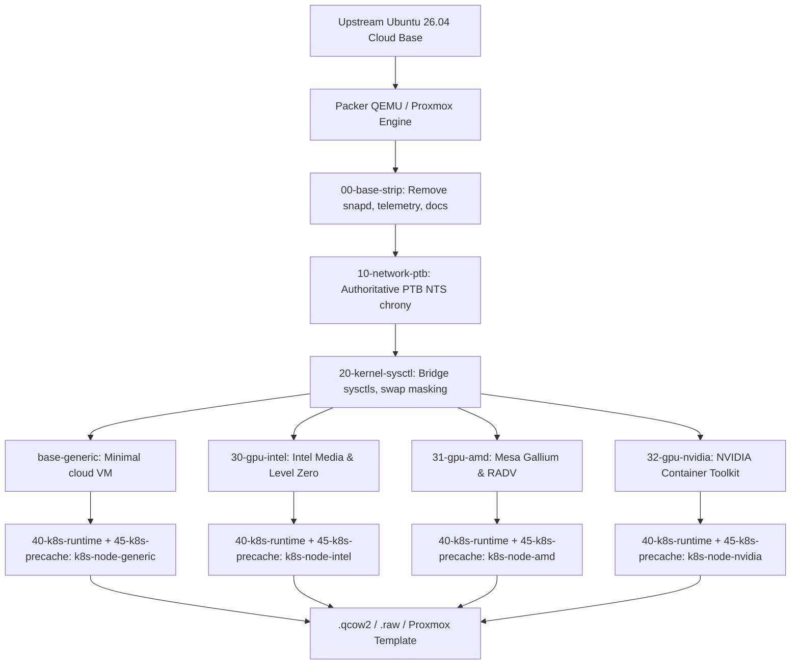

# lusoris-cloud-images

[](https://github.com/lusoris/lusoris-cloud-images/actions/workflows/lint.yml)
[](https://www.packer.io/)
[](LICENSE)

> Highly optimized, hardened, and hardware-accelerated cloud and bare-metal OS images with pre-baked Kubernetes runtimes.

---

## Overview

`lusoris-cloud-images` is an automated OS image forge designed to produce minimal, hardened, and vendor-specialized cloud images (`.qcow2`, `.raw`, Proxmox templates).

Instead of deploying generic bloated OS templates that pull gigabytes of packages and container images on every first boot, `lusoris-cloud-images` provides:

- **Zero Base Bloat**: Complete elimination of Canonical snaps, telemetry services (`ubuntu-pro-client`, `landscape-common`, `popularity-contest`), motd news, and unneeded documentation.
- **Hardware Acceleration Flavors**: Tailored GPU driver stacks for Intel Arc/Flex/iGPU, AMD Radeon, and NVIDIA eliminate competing package conflicts.
- **Instantaneous Kubernetes Node Boot**: Worker node images pre-bake `containerd 2.x`, pinned `kubelet`/`kubeadm`, and pre-pull essential cluster DaemonSets (`cilium`, `kube-vip`, device plugins) directly into the CRI store.
- **Authoritative Time via PTB NTS**: Cryptographically authenticated Network Time Security (NTS) from Physikalisch-Technische Bundesanstalt (`ptbtime1.ptb.de` - `ptbtime4.ptb.de`) pre-configured.

---

## Architecture



---

## Flavor Matrix

| Flavor | Target Platform / Hardware | Acceleration Stack | Included Components |
| :--- | :--- | :--- | :--- |
| **`base-generic`** | General purpose VMs & Cloud instances | VirtIO / Headless | Minimal hardened OS, PTB NTS, qemu-guest-agent |
| **`base-intel`** | Intel Core Gen 8–14+, Arc Alchemist/Battlemage | Intel Media Driver (`iHD`), Level Zero, oneAPI | Intel compute/media drivers, vainfo, clinfo |
| **`base-amd`** | AMD Radeon RX series, Ryzen APUs | Mesa Gallium (`radeonsi`), RADV Vulkan | AMDGPU DRM, Mesa VA-API/Vulkan, vainfo |
| **`base-nvidia`** | NVIDIA Pascal through Blackwell | NVIDIA Container Toolkit | nvidia-container-toolkit, CDI hooks |
| **`k8s-node-generic`**| Kubernetes Worker / Control-Plane | VirtIO / CPU | containerd 2.x, kubelet/kubeadm, pre-cached Cilium/kube-vip |
| **`k8s-node-intel`**  | Kubernetes Worker with Intel GPU | Intel Arc/iGPU + containerd | Intel drivers + Intel K8s Device Plugin pre-cached |
| **`k8s-node-amd`**    | Kubernetes Worker with AMD GPU | AMD Radeon + containerd | AMD drivers + AMD K8s Device Plugin pre-cached |
| **`k8s-node-nvidia`** | Kubernetes Worker with NVIDIA GPU | NVIDIA GPU + containerd | NVIDIA toolkit + NVIDIA K8s Device Plugin pre-cached |

---

## Quickstart

### Prerequisites

- [Packer](https://developer.hashicorp.com/packer/install) >= 1.9.0
- [QEMU](https://www.qemu.org/) with KVM support (`qemu-system-x86_64`)
- ShellCheck & Yamllint (for development and linting)

### Build Locally (Standalone QEMU)

```bash
# Clone the repository
git clone https://github.com/lusoris/lusoris-cloud-images.git
cd lusoris-cloud-images

# Initialize plugins
make init

# Run static quality gates
make lint
make test

# Build a specific image flavor (outputs to output-images/<flavor>/)
make build-generic
make build-intel
make build-k8s-intel
```

---

## Repository Structure

```text
.
├── .agents/skills/            # Agent slash command skills (/build-image, /lint-all, etc.)
├── .github/workflows/         # Continuous integration linting & build automation
├── packer/
│   ├── versions.pkr.hcl       # Required Packer plugins (qemu, proxmox)
│   ├── variables.pkr.hcl      # Dynamic build variables and Proxmox credentials
│   ├── sources.pkr.hcl        # QEMU and Proxmox builder sources
│   ├── builds.pkr.hcl         # Multi-flavor pipeline definitions
│   ├── http/                  # Headless cloud-init seed data
│   └── provisioners/          # Modular shell scripts (NASA/JPL Power of 10 compliant)
├── tests/                     # Pytest configuration and integrity assertions
├── AGENTS.md                  # Operating charter and architectural invariants
├── Makefile                   # Developer commands
├── ONBOARDING.md              # Project switch & onboarding guide
└── README.md                  # Documentation
```
