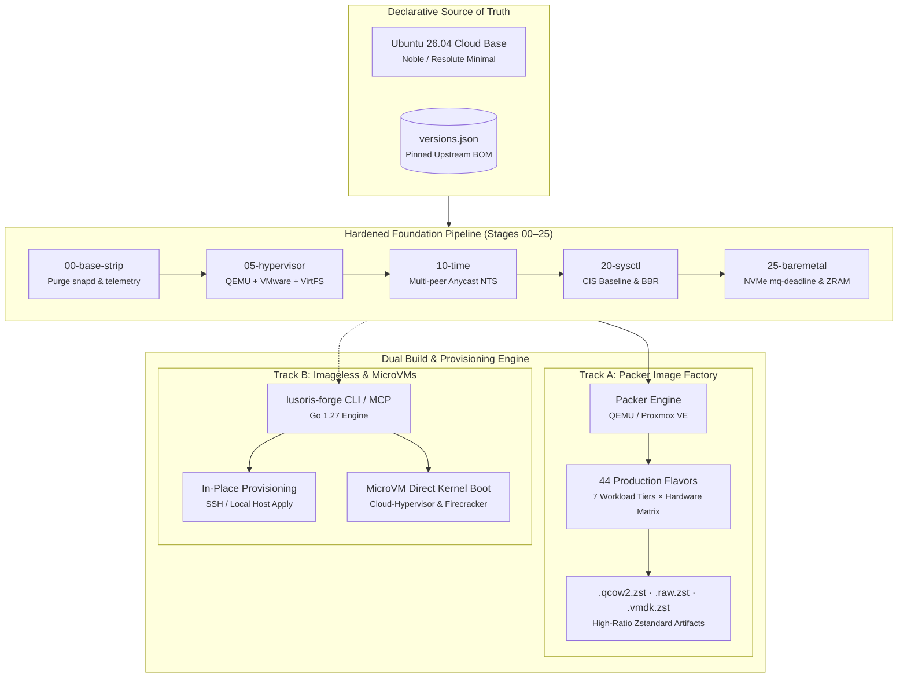

# lusoris-cloud-images

<div align="center">

[](https://github.com/lusoris/lusoris-cloud-images/actions/workflows/ci.yml)
[](https://github.com/lusoris/lusoris-cloud-images/actions/workflows/security-scans.yml)
[](https://github.com/lusoris/lusoris-cloud-images/actions/workflows/supply-chain.yml)
[](https://github.com/lusoris/lusoris-cloud-images/actions/workflows/release-matrix.yml)

[](FLAVORS.md)
[](versions.json)
[](https://www.packer.io/)
[](versions.schema.json)
[](docs/security/time-nts.md)

[](docs/hardware/nvidia.md)
[](docs/platforms/proxmox.md)
[](docs/principles.md)
[](https://lusoris.github.io/lusoris-cloud-images)
[](LICENSE)

<br/>

**Enterprise-grade, hardened, hardware-accelerated cloud and bare-metal OS image forge with pre-baked runtimes.**

[📖 Documentation Portal](https://lusoris.github.io/lusoris-cloud-images) &nbsp;•&nbsp;
[📋 Complete Flavor Catalog (44 Flavors)](FLAVORS.md) &nbsp;•&nbsp;
[📐 Architecture & Principles](docs/principles.md) &nbsp;•&nbsp;
[🔒 Security Advisories](https://github.com/lusoris/lusoris-cloud-images/security/advisories)

</div>

---

## Why lusoris-cloud-images?

Stock cloud distributions waste minutes downloading gigabytes of kernel modules, GPU drivers, and container runtimes on first boot. `lusoris-cloud-images` bakes these dependencies into production-ready, verified images (`.qcow2`, `.raw`, `.vmdk`, and Proxmox/Unraid/VMware templates).

- **Zero Base Bloat**: Complete elimination of Canonical snaps, telemetry services (`ubuntu-pro-client`, `landscape-common`, `popularity-contest`), motd news, and unneeded documentation.
- **Single Source of Truth (`versions.json`)**: Every upstream URL, driver branch, and container tag originates from a single declarative manifest validated against `versions.schema.json`.
- **Multi-Generational Hardware**: Tailored driver stacks for Intel Arc/Flex/Xe2, AMD Mesa/ROCm 10, and NVIDIA generational CUDA (Pascal 535, Ampere/Ada 565, Hopper/Blackwell 610/615).
- **Hypervisor & Bare-Metal Speed Engine**: Coexisting `qemu-guest-agent` + `open-vm-tools`, Unraid `virtiofs`/`9p` host sharing, fast-boot `NoCloud` discovery (< 2s), ZRAM compressed swap guard, weekly `fstrim.timer`, and VirtIO `mq-deadline` I/O scheduling.
- **Resilient Global Time**: Cryptographically authenticated Network Time Security (NTS RFC 8915) combining Cloudflare Anycast and European national metrology laboratories (PTB, Netnod, SIDN, 3eck).

---

## Build Architecture



---

## Workload Tier Summary (44 Flavors)

To keep maintenance low and usability high, flavors are partitioned into 7 distinct tiers. 

| Tier | Flavors | Hardware Acceleration | Key Runtime Components | Documentation |
| :--- | :---: | :--- | :--- | :--- |
| **1. Base Cloud** | 8 | Generic, Intel Xe, AMD Mesa, NVIDIA (535 to 615) | Hardened OS, Anycast NTS, QEMU/VMware agents | [📖 Base Guide](docs/flavors/base.md) |
| **2. Container Hosts** | 7 | Generic, Intel QuickSync, AMD ROCm, NVIDIA CDI | Docker CE 29.8, Docker Compose v2, Podman 5.x | [📖 Containers Guide](docs/flavors/containers.md) |
| **3. Enterprise K8s** | 9 | Generic, Intel Arc, AMD ROCm 10, NVIDIA Mainstream/Bleeding | containerd 2.3.5, kubelet 1.37.0, Cilium/Calico preheat | [📖 Kubernetes Guide](docs/flavors/kubernetes.md) |
| **4. K3s Edge Fleet** | 5 | Generic, Intel QuickSync, AMD ROCm 10, NVIDIA CDI | Lightweight K3s (< 300MB RAM), Flannel, SQLite | [📖 K3s Guide](docs/flavors/k3s.md) |
| **5. CloudNative & Storage** | 4 | Generic, Baremetal, NVMe-oF, OpenZFS 2.3 | Read-only root immutability, OpenZFS, CloudNativePG | [📖 CloudNative Guide](docs/flavors/cloudnative.md) |
| **6. AI & LLM Inference** | 6 | AMX/AVX-512, Intel Xe2, AMD ROCm 10, NVIDIA (565/610/615) | Transparent Hugepages, NUMA, vLLM / Ollama | [📖 AI Inference Guide](docs/flavors/ai-infer.md) |
| **7. Homelab Appliances** | 5 | Coral TPU, QuickSync, Dual VA-API, ARM64 binfmt, i386 | Frigate NVR, AdGuard/Pi-hole, Jellyfin, CI runner, SteamCMD | [📖 Homelab Guide](docs/flavors/homelab-appliances.md) |

> 📋 **Detailed Specifications**: Browse the complete list of all 44 target configurations in [**`FLAVORS.md`**](FLAVORS.md) or explore them interactively in the [**Documentation Portal Matrix**](https://lusoris.github.io/lusoris-cloud-images/flavors/matrix/).

---

## Quickstart

### Prerequisites

- [Packer](https://developer.hashicorp.com/packer/install) $\ge$ 1.9.0
- [QEMU](https://www.qemu.org/) with KVM support (`qemu-system-x86_64`)
- ShellCheck, Shfmt, and Yamllint

### Build Locally (Standalone QEMU)

```bash
# Clone the repository
git clone https://github.com/lusoris/lusoris-cloud-images.git
cd lusoris-cloud-images

# Initialize plugins and run quality gates
make init
make lint
make test

# Build images (or specify any flavor from FLAVORS.md)
make build-base-generic        # Minimal hardened OS
make build-docker-nvidia       # Docker CE + NVIDIA 565 Container Toolkit
make build-k8s-cilium          # Enterprise K8s + preheated Cilium
make build-k3s-agent-generic   # Lightweight Edge K3s worker (< 300MB RAM)
make build-cloudnative-generic # Immutable container host (read-only root)
make build-cloudnative-storage # CNCF storage appliance (NVMe-oF / ZFS)
make build-ai-infer-nvidia     # AI inference appliance (vLLM / NUMA tuning)
```

---

## Repository & Documentation Map

```text
.
├── versions.json              # Single Source of Truth (SSOT) for all versions
├── versions.schema.json       # JSON Schema (Draft 2020-12) validating SSOT
├── FLAVORS.md                 # Segmented catalog of all 39 flavors & make targets
├── mkdocs.yml                 # Documentation portal configuration
├── docs/                      # Comprehensive engineering documentation
│   ├── flavors/               # Detailed guides for each workload tier
│   ├── platforms/             # Hypervisors: Proxmox, Unraid, VMware, Bare-Metal
│   ├── hardware/              # Acceleration: NVIDIA CUDA, Intel Arc, AMD ROCm
│   ├── security/              # CIS Benchmarks, Anycast NTS, Supply Chain
│   ├── adr/                   # Architecture Decision Records (0001–0007)
│   └── community/             # Contributing, Security, Audits, Governance
├── packer/                    # Modular Packer HCL2 templates & shell provisioners
├── tests/                     # Automated pytest verification suite
└── Makefile                   # Unified local targets (lint, test, build-*)
```

---

## Governance & Security

- **Security Advisories**: To report security vulnerabilities, open a [GitHub Private Security Advisory](https://github.com/lusoris/lusoris-cloud-images/security/advisories/new).
- **Engineering Principles**: All changes must satisfy [Engineering Principles](docs/principles.md) and [Rule Crosswalk](docs/repository-rule-crosswalk.md).
- **License**: [Apache 2.0](LICENSE) — Copyright &copy; 2026 The Lusoris Authors.
