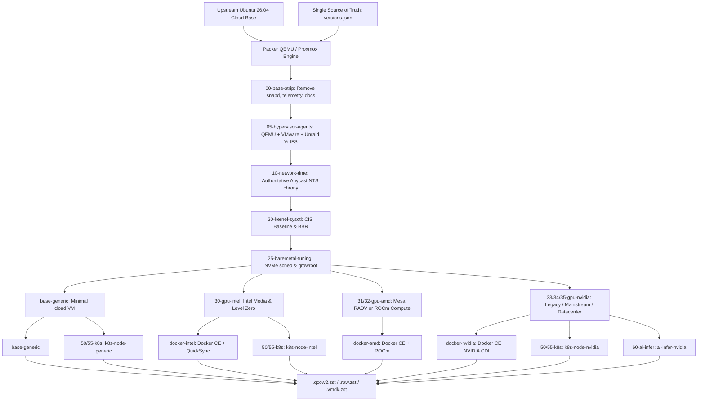

# lusoris-cloud-images

[](https://github.com/lusoris/lusoris-cloud-images/actions/workflows/ci.yml)
[](https://github.com/lusoris/lusoris-cloud-images/actions/workflows/security-scans.yml)
[](https://www.packer.io/)
[](https://lusoris.github.io/lusoris-cloud-images)
[](LICENSE)

> Enterprise-grade, hardened, hardware-accelerated cloud and bare-metal OS image forge with pre-baked runtimes.

📖 **Full Documentation Portal**: [https://lusoris.github.io/lusoris-cloud-images](https://lusoris.github.io/lusoris-cloud-images)

---

## Overview

`lusoris-cloud-images` is an automated, open-source OS image forge producing minimal, hardened, and vendor-specialized OS images (`.qcow2`, `.raw`, `.vmdk`, and Proxmox/Unraid/VMware templates).

Instead of deploying generic stock distributions that spend minutes pulling gigabytes of packages and container layers on first boot, `lusoris-cloud-images` provides:

- **Zero Base Bloat**: Complete elimination of Canonical snaps, telemetry services (`ubuntu-pro-client`, `landscape-common`, `popularity-contest`), motd news, and unneeded documentation.
- **Single Source of Truth (`versions.json`)**: Upstream distribution URLs, Kubernetes versions, DaemonSets, and driver branches are centrally managed in one file.
- **Hardware Acceleration Tiers**: Tailored GPU driver stacks for Intel Arc/Flex/Xe, AMD Mesa & ROCm, and NVIDIA generational CUDA (Pascal 535, Ampere/Ada 565, Hopper/Blackwell Open Modules + Fabric Manager).
- **Multi-Hypervisor Portability**: Coexisting `qemu-guest-agent` and `open-vm-tools`, Unraid `virtiofs`/`9p` host sharing, and ACPI clean power shutdown.
- **Bare-Metal Performance Engine**: NVMe low-latency I/O scheduling, BBR congestion control, automatic first-boot root expansion (`growpart`), and direct disk streaming (`lusoris-install-to-disk`).
- **Resilient Global Time**: Cryptographically authenticated Network Time Security (NTS) using Cloudflare Anycast and European national metrology institutes (PTB, Netnod, SIDN, 3eck).

---

## Architecture



---

## The 4-Dimensional Flavor Matrix (26 Flavors)

| Flavor | Workload | Hardware Stack | Kernel Profile | Key Components |
| :--- | :--- | :--- | :--- | :--- |
| **`base-generic`** | Minimal OS | VirtIO / CPU | `generic` | Zero bloat, Anycast NTS, QEMU+VMware agents |
| **`base-intel`** | Minimal OS | Intel Xe/Arc/Xe2 | `generic` | Intel Media Driver (`iHD`), Level Zero, vainfo, Battlemage Xe2 |
| **`base-amd`** | Minimal OS | AMD GPU | `generic` | Mesa Gallium `radeonsi`, RADV Vulkan, AMDGPU DRM |
| **`base-nvidia-legacy`** | Minimal OS | NVIDIA Pascal/Volta | `generic` | NVIDIA 535 driver, CUDA 12.2, GTX 1080, P4, P40, P100, V100 |
| **`base-nvidia-mainstream`**| Minimal OS | NVIDIA Turing/Ampere | `generic` | NVIDIA 565 driver, CUDA 12.8, RTX 20/30/40, A100, L4 |
| **`base-nvidia-bleeding`** | Minimal OS | NVIDIA Blackwell | `generic` | NVIDIA 615 driver, CUDA 13.4, RTX 5090, B200 |
| **`base-nvidia-datacenter`**| Minimal OS | NVIDIA Hopper/Blackwell | `baremetal` | NVIDIA 615 Open Modules, Fabric Manager, NVLink mesh |
| **`docker-generic`** | Docker Host | VirtIO / CPU | `generic` | Docker CE 29.8, Docker Compose v2, log rotation |
| **`docker-intel`** | Docker Host | Intel GPU | `generic` | Docker CE + Intel QuickSync passthrough + CDI spec |
| **`docker-amd`** | Docker Host | AMD GPU | `generic` | Docker CE + AMD ROCm 10 compute runtime + CDI spec |
| **`docker-nvidia`** | Docker Host | NVIDIA Mainstream | `generic` | Docker CE + NVIDIA 565 + NVIDIA Container Toolkit CDI |
| **`docker-nvidia-bleeding`** | Docker Host | NVIDIA Bleeding | `generic` | Docker CE + NVIDIA 615 + NVIDIA Container Toolkit CDI |
| **`podman-generic`** | Rootless OCI | VirtIO / CPU | `generic` | Podman 5.x, Buildah, Skopeo, Quadlet, Netavark CNI |
| **`k8s-node-generic`** | K8s Worker | VirtIO / CPU | `k8s` | containerd 2.3.5, kubelet 1.37.0, lean zero-preheat |
| **`k8s-node-cilium`** | K8s Worker | VirtIO / CPU | `k8s` | containerd 2.3.5, preheated Cilium 1.20.1 & kube-vip 1.2.3 |
| **`k8s-node-calico`** | K8s Worker | VirtIO / CPU | `k8s` | containerd 2.3.5, preheated Calico 3.32.2 & kube-vip 1.2.3 |
| **`k8s-node-flannel`** | K8s Worker | VirtIO / CPU | `k8s` | containerd 2.3.5, preheated Flannel 0.28.9 & kube-vip 1.2.3 |
| **`k8s-node-intel`** | K8s Worker | Intel Arc/Xe2 | `k8s` | containerd 2.3.5 + Intel drivers + Intel K8s Plugin v0.36.0 |
| **`k8s-node-amd`** | K8s Worker | AMD GPU | `k8s` | containerd 2.3.5 + AMD ROCm 10 + AMD K8s Plugin v1.37.0 |
| **`k8s-node-nvidia`** | K8s Worker | NVIDIA Mainstream | `k8s` | containerd 2.3.5 + NVIDIA 565 + NVIDIA K8s Plugin v0.20.0 |
| **`k8s-node-nvidia-bleeding`** | K8s Worker | NVIDIA Bleeding | `k8s` | containerd 2.3.5 + NVIDIA 615 + NVIDIA K8s Plugin v0.20.0 |
| **`ai-infer-generic`** | AI Inference | CPU High-Throughput | `ai-infer` | AMX, AVX-512, NUMA, vLLM / Ollama CPU, Docker CE |
| **`ai-infer-intel`** | AI Inference | Intel Xe/Arc/Xe2 | `ai-infer` | Intel Level Zero, OpenVINO, IPEX-LLM, CDI, Docker CE |
| **`ai-infer-amd`** | AI Inference | AMD ROCm 10 | `ai-infer` | AMD ROCm 10, /dev/kfd, RDNA 3/4 & Instinct, CDI, Docker CE |
| **`ai-infer-nvidia`** | AI Inference | NVIDIA Mainstream | `ai-infer` | NVIDIA 565, Transparent Hugepages, NUMA, vLLM, Docker CE |
| **`ai-infer-nvidia-bleeding`**| AI Inference | NVIDIA Bleeding | `ai-infer` | NVIDIA 615, Blackwell RTX 5090 / B200, vLLM, Docker CE |

---

## Quickstart

### Prerequisites

- [Packer](https://developer.hashicorp.com/packer/install) >= 1.9.0
- [QEMU](https://www.qemu.org/) with KVM support (`qemu-system-x86_64`)
- ShellCheck, Shfmt, and Yamllint

### Build Locally (Standalone QEMU)

```bash
# Clone the repository
git clone https://github.com/lusoris/lusoris-cloud-images.git
cd lusoris-cloud-images

# Initialize plugins and run quality gates
make init
make lint
make test

# Build images across the matrix
make build-base-generic
make build-docker-generic
make build-docker-nvidia
make build-k8s-generic        # Lean zero-preheat
make build-k8s-cilium         # Preheated Cilium
make build-ai-infer-generic   # CPU High-Throughput
make build-ai-infer-intel     # Intel Arc / Battlemage Xe2
make build-ai-infer-amd       # AMD ROCm 10
make build-ai-infer-nvidia    # NVIDIA Mainstream
make build-ai-infer-nvidia-bleeding # NVIDIA Bleeding Blackwell
```

---

## Repository Structure

```text
.
├── versions.json              # Single Source of Truth for all component versions
├── mkdocs.yml                 # Material for MkDocs configuration
├── docs/                      # Full documentation portal (guides, matrix, ADRs)
├── .github/
│   ├── CODEOWNERS             # Repository code owners
│   ├── PULL_REQUEST_TEMPLATE.md
│   ├── ISSUE_TEMPLATE/        # Structured issue forms
│   └── workflows/             # Enterprise CI/CD suite (ci, security, supply-chain, pages)
├── packer/
│   ├── versions.pkr.hcl       # Required Packer plugins
│   ├── variables.pkr.hcl      # Universal build variables
│   ├── sources.pkr.hcl        # QEMU and Proxmox builder sources
│   ├── builds.pkr.hcl         # Modular 26-flavor pipeline definitions
│   ├── http/                  # Headless cloud-init seed data
│   └── provisioners/          # Modular shell scripts (NASA/JPL Power of 10 compliant)
├── tests/                     # Automated pytest verification suite
├── AGENTS.md                  # Operating charter and architectural invariants
├── CLAUDE.md                  # Developer and agent guide
├── CONTRIBUTING.md            # Contribution workflow and PR guidelines
├── SECURITY.md                # Vulnerability disclosure policy
├── Makefile                   # Unified developer targets
└── README.md                  # Project overview
```
