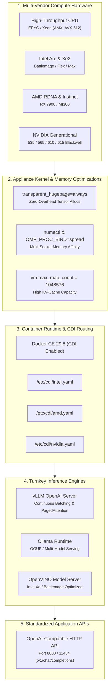

# AI & LLM Inference Appliances

The `ai-infer-*` flavors provide turnkey environments for high-throughput Large Language Model (LLM) and multimodal inference serving across all major hardware vendors: **Generic CPU**, **Intel Arc/Battlemage**, **AMD ROCm**, and **NVIDIA Generational GPUs**.

All appliances come pre-configured with **Docker CE 29.8**, vendor Container Device Interface (CDI) specifications, transparent hugepages, NUMA node binding, and standardized persistent cache paths.

---

## The Multi-Vendor AI Matrix

| Flavor Name | Hardware Stack | Acceleration Runtime | Target Hardware | Container Pass-Through |
| :--- | :--- | :--- | :--- | :--- |
| **`ai-infer-generic`** | CPU High-Throughput | AMX, AVX-512, OpenMP | Multi-socket EPYC, Xeon, Threadripper | Docker CE (CPU isolation) |
| **`ai-infer-intel`** | Intel Xe / Arc / Xe2 | Level Zero, OpenCL, OpenVINO | Arc A770, Battlemage Xe2 (B580), Flex, Max | CDI (`/etc/cdi/intel.yaml`) |
| **`ai-infer-amd`** | AMD ROCm 10 | ROCm HIP, rocBLAS, MIOpen | Radeon RX 7900/8000, Instinct MI200/MI300 | CDI (`/etc/cdi/amd.yaml`) |
| **`ai-infer-nvidia`** | NVIDIA Mainstream | CUDA 12.8, TensorRT-LLM | RTX 20/30, A100, L4, RTX A6000 | CDI (`/etc/cdi/nvidia.yaml`) |
| **`ai-infer-nvidia-modern`** | NVIDIA Modern | CUDA 13.3, Ada / Hopper TE | RTX 4080/4090, L40, L40S, H100 PCIe | CDI (`/etc/cdi/nvidia.yaml`) |
| **`ai-infer-nvidia-bleeding`**| NVIDIA Bleeding | CUDA 13.4, Blackwell 2nd-gen TE| GeForce RTX 5090, B100, B200, GB200 NVL | CDI (`/etc/cdi/nvidia.yaml`) |



---

## Common System Optimizations

Every `ai-infer-*` image bakes in kernel and userspace low-latency optimizations:
- **Transparent Hugepages & Memory Overcommit**: Configured with `transparent_hugepage=always` kernel cmdline, `vm.overcommit_memory = 1`, and `vm.max_map_count = 1048576` for zero-overhead tensor allocations.
- **NUMA Interleaving**: Pre-installed `numactl`, `libnuma-dev`, and `libgomp1` with `OMP_PROC_BIND=spread` and `OMP_PLACES=threads`.
- **Persistent Model Caches**: Standardized cache directories pre-created at:
  - `/var/lib/models/huggingface` (`export HF_HOME="/var/lib/models/huggingface"`)
  - `/var/lib/models/ollama` (`export OLLAMA_MODELS="/var/lib/models/ollama"`)
  - `/var/lib/models/vllm` (`export VLLM_CACHE_ROOT="/var/lib/models/vllm"`)
- **Docker CE 29.8**: Pre-installed with native CDI feature flag (`features.cdi = true`) and `live-restore: true`.

---

## Launching Inference Engines by Vendor

### 1. NVIDIA (Mainstream, Modern Ada/Hopper & Bleeding-Edge Blackwell)
Run high-throughput vLLM or Ollama using NVIDIA Container Toolkit or CDI:
```bash
docker run -d --name vllm \
  --runtime nvidia --gpus all \
  -v /var/lib/models/huggingface:/root/.cache/huggingface \
  -p 8000:8000 --ipc=host \
  vllm/vllm-openai:latest \
  --model meta-llama/Llama-3.3-70B-Instruct
```

### 2. AMD ROCm 10 (Radeon & Instinct)
Deploy vLLM ROCm or Ollama with direct access to `/dev/kfd` and `/dev/dri`:
```bash
docker run -d --name vllm-rocm \
  --device /dev/kfd --device /dev/dri \
  --group-add render \
  -v /var/lib/models/huggingface:/root/.cache/huggingface \
  -p 8000:8000 --ipc=host \
  rocm/vllm:latest \
  --model mistralai/Mistral-7B-Instruct-v0.3
```

### 3. Intel Arc & Battlemage Xe2 (OpenVINO / IPEX-LLM)
Serve models with Intel Level Zero GPU compute via CDI or direct render node pass-through:
```bash
docker run -d --name vllm-openvino \
  --device /dev/dri \
  -v /var/lib/models/huggingface:/root/.cache/huggingface \
  -p 8000:8000 --ipc=host \
  openvino/model_server:latest \
  --model_name llama3 --model_path /root/.cache/huggingface
```

### 4. Generic CPU (AVX-512 / AMX / NUMA)
Run multi-threaded CPU inference using llama.cpp server or vLLM-CPU:
```bash
docker run -d --name llama-cpp-cpu \
  --cpuset-cpus "0-31" \
  -v /var/lib/models/huggingface:/models \
  -p 8080:8080 \
  ghcr.io/ggerganov/llama.cpp:server \
  -m /models/Llama-3.2-3B-Instruct-Q4_K_M.gguf -c 4096 --threads 32
```


