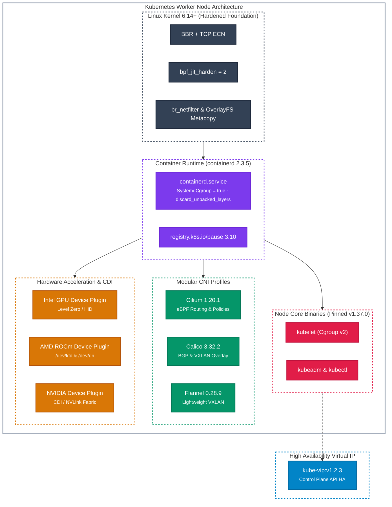

# Kubernetes Node Flavors

`k8s-node-*` flavors provide production-grade, hardened Kubernetes worker node appliances running on Ubuntu 26.04 LTS (Resolute) with containerd 2.x and strict Cgroup v2 resource accounting.

To balance zero first-boot latency with disk footprint, `lusoris-cloud-images` provides both **Lean (Zero-Preheat)** and **Preheated CNI Profiles** (`cilium`, `calico`, `flannel`).

---

## Pre-Baked Runtimes & Container Standards

- **Distro Base**: Ubuntu 26.04 LTS (Resolute) cloud kernel.
- **Container Runtime**: `containerd 2.3.5` with native Cgroup v2 systemd driver (`SystemdCgroup = true`), `discard_unpacked_layers = true` for SSD/NVMe endurance, and `sandbox_image = "registry.k8s.io/pause:3.10"`.
- **Node Binaries**: Pinned Kubernetes `v1.37.0` (`kubelet`, `kubeadm`, `kubectl`) held via `apt-mark hold`.
- **Kernel Acceleration**: OverlayFS metacopy and redirect directory acceleration (`metacopy=on`, `redirect_dir=on`), BPF JIT compiler hardening (`bpf_jit_harden=2`), and conntrack table scaled to 1,048,576 entries.
- **Networking**: `br_netfilter` loaded, bridge sysctls active (`net.bridge.bridge-nf-call-iptables = 1`), IP forwarding enabled, and swap permanently disabled.



---

## Modular Preheat Profiles

Image pre-caching is driven declaratively via the `preheat_profile` Packer variable:

| Preheat Profile | Cached Images | Use Case |
| :--- | :--- | :--- |
| **`lean`** | `pause:3.10` only | Bare minimum footprint (~800MB root). Ideal for clusters pulling images from a local pull-through registry or air-gapped mirror. |
| **`cilium`** | `pause:3.10`, `coredns:v1.14.7`, `cilium:v1.20.1`, `cilium/operator-generic:v1.20.1`, `kube-vip:v1.2.3`, `node-exporter:v1.12.1` | eBPF-native clusters using Cilium for L3/L4/L7 routing, egress gateway, and NetworkPolicy. |
| **`calico`** | `pause:3.10`, `coredns:v1.14.7`, `calico/cni:v3.32.2`, `calico/node:v3.32.2`, `calico/kube-controllers:v3.32.2`, `kube-vip:v1.2.3`, `node-exporter:v1.12.1` | Enterprise BGP and standard IP-in-IP / VXLAN overlay clusters using Tigera Calico. |
| **`flannel`** | `pause:3.10`, `coredns:v1.14.7`, `flannel:v0.28.9`, `flannel-cni-plugin:v1.6.2-flannel1`, `kube-vip:v1.2.3`, `node-exporter:v1.12.1` | Minimal, lightweight overlay networking for edge or resource-constrained nodes. |

---

## Hardware-Specific Node Flavors

All hardware-specific flavors include the respective Container Device Interface (CDI) specifications and device plugins preheated in containerd's `k8s.io` namespace:

- **`k8s-node-generic`**: Standard CPU worker node with `lean` zero-preheat footprint.
- **`k8s-node-cilium`**: Standard CPU worker node with preheated Cilium eBPF stack.
- **`k8s-node-calico`**: Standard CPU worker node with preheated Calico networking.
- **`k8s-node-flannel`**: Standard CPU worker node with preheated Flannel overlay.
- **`k8s-node-intel`**: Intel Arc/Xe2 acceleration with Intel Device Plugin (`intel/intel-device-plugins-gpu:v0.36.0`).
- **`k8s-node-amd`**: AMD ROCm 10 compute runtime with AMD GPU Device Plugin (`rocm/k8s-device-plugin:v1.37.0`).
- **`k8s-node-nvidia`**: NVIDIA Mainstream 565 driver with NVIDIA K8s Device Plugin (`nvcr.io/nvidia/k8s-device-plugin:v0.20.0`).
- **`k8s-node-nvidia-modern`**: NVIDIA Modern 610 driver (Ada Lovelace / Hopper) with NVIDIA K8s Device Plugin.
- **`k8s-node-nvidia-bleeding`**: NVIDIA Bleeding 615 driver (Blackwell RTX 5090 / B200) with NVIDIA K8s Device Plugin.

---

## High-Performance Dual Runtimes (`runc` & `crun`)

Following [ADR-0010](../adr/0010-container-ecosystem-runtimes-and-tooling.md), all `k8s-node-*` appliances ship with both standard `runc` and the ultra-fast, C-based `crun` OCI runtime:

- **Default Runtime (`runc`)**: Guarantees universal compatibility with third-party tools, security scanners, and stock Kubernetes workloads.
- **Accelerated Runtime (`crun`)**: Pre-registered in `/etc/containerd/config.toml` (`io.containerd.runc.v2` with `BinaryName = "crun"`). Cuts container creation latency by 2–3x and reduces per-container runtime resident memory from ~25MB to ~4MB.

To utilize `crun` on any deployment, define a cluster `RuntimeClass` and reference it in the Pod spec:

```yaml
apiVersion: node.k8s.io/v1
kind: RuntimeClass
metadata:
  name: crun
handler: crun
---
apiVersion: v1
kind: Pod
metadata:
  name: high-performance-workload
spec:
  runtimeClassName: crun
  containers:
    - name: app
      image: registry.example.com/workload:latest
```

---

## Zero-Footprint Container Diagnostics (`cdebug`)

All Kubernetes node images pre-bake `cdebug` under `/usr/local/bin/cdebug`. Operators can troubleshoot distroless or minimal containers directly on the host without mutating the target container or installing debugging packages inside production pods:

```bash
# Attach an ephemeral debugging shell to a running container via containerd
sudo cdebug exec -it --runtime containerd <container-id>

# Attach a fully-equipped network diagnostic toolkit (netshoot) to a pod namespace
sudo cdebug exec -it --image nicolaka/netshoot --runtime containerd <container-id>
```

