# The 4D Flavor Matrix (44 Flavors)

`lusoris-cloud-images` structures operating system images across four orthogonal dimensions: **Platform**, **Workload Tier**, **Hardware Acceleration**, and **Security Hardening**.

All 44 flavors originate from a single base configuration and are customized via declarative Packer pipelines.

```mermaid
flowchart LR
    subgraph Dimensions["The 4 Orthogonal Dimensions"]
        D1["Dimension 1: Platform<br/><small>Proxmox · Unraid · ESXi · BareMetal</small>"]
        D2["Dimension 2: Workload Tier<br/><small>Base · Containers · K8s · K3s · CloudNative · AI · Homelab</small>"]
        D3["Dimension 3: Hardware Acceleration<br/><small>VirtIO · Intel Xe · AMD ROCm · NVIDIA 535–615 · Coral</small>"]
        D4["Dimension 4: Hardening Profile<br/><small>CIS L2 · NTS Chrony · BBR · Immutable Root</small>"]
    end

    subgraph Tiers["7 Workload Tiers (44 Production Flavors)"]
        T1["Tier 1: Base Cloud (8)"]
        T2["Tier 2: Container Hosts (7)"]
        T3["Tier 3: Enterprise K8s (9)"]
        T4["Tier 4: K3s Edge Fleet (5)"]
        T5["Tier 5: CloudNative & Storage (4)"]
        T6["Tier 6: AI & LLM Inference (6)"]
        T7["Tier 7: Homelab Appliances (5)"]
    end

    subgraph Deliverables["Output Artifacts"]
        Out["44 Production Cloud Images<br/><small>.qcow2.zst · .raw.zst · .vmdk.zst</small>"]
    end

    Dimensions --> Tiers
    Tiers --> Deliverables
```

---

## Interactive Flavor Explorer

=== "Tier 1: Base Cloud (8)"

    Minimal, hardened OS images with coexisting hypervisor agents (`qemu-guest-agent`, `open-vm-tools`), cryptographically verified Network Time Security (NTS), and GPU driver runtimes.

    📖 [View Base Tier Documentation](base.md)

    | Flavor Name | Hardware Stack | Kernel Profile | Key Components | Build Target |
    | :--- | :--- | :--- | :--- | :--- |
    | **`base-generic`** | VirtIO / Generic CPU | `generic` | Minimal OS, Anycast NTS, QEMU+VMware agents | `make build-base-generic` |
    | **`base-intel`** | Intel Xe / Arc / Xe2 | `generic` | Intel Media Driver (`iHD`), Level Zero, vainfo | `make build-base-intel` |
    | **`base-amd`** | AMD Mesa / RADV | `generic` | Mesa Gallium `radeonsi`, RADV Vulkan, AMDGPU DRM | `make build-base-amd` |
    | **`base-nvidia-legacy`** | NVIDIA Pascal / Volta | `generic` | NVIDIA 535 driver, CUDA 12.2, GTX 1080/P4/P40/V100 | `make build-base-nvidia-legacy` |
    | **`base-nvidia-mainstream`** | NVIDIA Turing / Ampere | `generic` | NVIDIA 565 driver, CUDA 12.8, RTX 20/30/40, A100 | `make build-base-nvidia-mainstream` |
    | **`base-nvidia-modern`** | NVIDIA Ada / Hopper | `generic` | NVIDIA 610 driver, CUDA 13.3, RTX 4080/4090, H100 | `make build-base-nvidia-modern` |
    | **`base-nvidia-bleeding`** | NVIDIA Blackwell | `generic` | NVIDIA 615 driver, CUDA 13.4, RTX 5090, B200 | `make build-base-nvidia-bleeding` |
    | **`base-nvidia-datacenter`** | NVIDIA Hopper / Blackwell | `baremetal` | NVIDIA 615 Open Kernel Modules, Fabric Manager | `make build-base-nvidia-datacenter` |

=== "Tier 2: Container Hosts (7)"

    Turnkey container appliances equipped with Docker CE 29.8, Docker Compose v2, or rootless Podman 5.x, along with declarative Container Device Interface (CDI) passthrough.

    📖 [View Containers Tier Documentation](containers.md)

    | Flavor Name | Hardware Stack | Kernel Profile | Key Components | Build Target |
    | :--- | :--- | :--- | :--- | :--- |
    | **`docker-generic`** | VirtIO / CPU | `generic` | Docker CE 29.8, Docker Compose v2, systemd cgroup | `make build-docker-generic` |
    | **`docker-intel`** | Intel GPU | `generic` | Docker CE + Intel QuickSync passthrough + CDI spec | `make build-docker-intel` |
    | **`docker-amd`** | AMD GPU | `generic` | Docker CE + AMD ROCm 10 compute runtime + CDI spec | `make build-docker-amd` |
    | **`docker-nvidia`** | NVIDIA Mainstream | `generic` | Docker CE + NVIDIA 565 + Container Toolkit CDI | `make build-docker-nvidia` |
    | **`docker-nvidia-modern`** | NVIDIA Modern | `generic` | Docker CE + NVIDIA 610 + Container Toolkit CDI | `make build-docker-nvidia-modern` |
    | **`docker-nvidia-bleeding`** | NVIDIA Bleeding | `generic` | Docker CE + NVIDIA 615 + Container Toolkit CDI | `make build-docker-nvidia-bleeding` |
    | **`podman-generic`** | VirtIO / CPU | `generic` | Podman 5.x, Buildah, Skopeo, Quadlet, Netavark CNI | `make build-podman-generic` |

=== "Tier 3: Enterprise Kubernetes (9)"

    Production Kubernetes worker nodes pre-baked with `containerd 2.3.5`, `kubelet 1.37.0`, `kubeadm`, and optional preheated CNI/VIP images for instant cluster join.

    📖 [View Kubernetes Tier Documentation](kubernetes.md)

    | Flavor Name | Hardware Stack | Preheat Profile | Key Components | Build Target |
    | :--- | :--- | :--- | :--- | :--- |
    | **`k8s-node-generic`** | VirtIO / CPU | `lean` | containerd 2.3.5, kubelet 1.37.0, zero pre-cache | `make build-k8s-generic` |
    | **`k8s-node-cilium`** | VirtIO / CPU | `cilium` | containerd 2.3.5, preheated Cilium 1.20.1 & kube-vip 1.2.3 | `make build-k8s-cilium` |
    | **`k8s-node-calico`** | VirtIO / CPU | `calico` | containerd 2.3.5, preheated Calico 3.32.2 & kube-vip 1.2.3 | `make build-k8s-calico` |
    | **`k8s-node-flannel`** | VirtIO / CPU | `flannel` | containerd 2.3.5, preheated Flannel 0.28.9 & kube-vip 1.2.3 | `make build-k8s-flannel` |
    | **`k8s-node-intel`** | Intel Arc / Xe2 | `cilium` | containerd 2.3.5 + Intel drivers + Intel K8s Plugin v0.36.0 | `make build-k8s-intel` |
    | **`k8s-node-amd`** | AMD ROCm 10 | `cilium` | containerd 2.3.5 + AMD ROCm 10 + AMD K8s Plugin v1.37.0 | `make build-k8s-amd` |
    | **`k8s-node-nvidia`** | NVIDIA Mainstream | `cilium` | containerd 2.3.5 + NVIDIA 565 + NVIDIA K8s Plugin v0.20.0 | `make build-k8s-nvidia` |
    | **`k8s-node-nvidia-modern`** | NVIDIA Modern | `cilium` | containerd 2.3.5 + NVIDIA 610 + NVIDIA K8s Plugin v0.20.0 | `make build-k8s-nvidia-modern` |
    | **`k8s-node-nvidia-bleeding`** | NVIDIA Bleeding | `cilium` | containerd 2.3.5 + NVIDIA 615 + NVIDIA K8s Plugin v0.20.0 | `make build-k8s-nvidia-bleeding` |

=== "Tier 4: K3s Edge Fleet (5)"

    Sub-300MB idle RAM Kubernetes nodes designed for resource-constrained edge systems, Intel N100 Alder Lake-N mini-PCs, and homelab media/GPU nodes.

    📖 [View K3s Edge Fleet Documentation](k3s.md)

    | Flavor Name | Role | Hardware Stack | Key Components | Build Target |
    | :--- | :--- | :--- | :--- | :--- |
    | **`k3s-agent-generic`** | Worker | VirtIO / CPU | Lightweight K3s agent, containerd, Flannel (< 300MB RAM) | `make build-k3s-agent-generic` |
    | **`k3s-agent-intel`** | Worker | Intel QuickSync | K3s agent + Intel Media Driver (`iHD`) + QuickSync | `make build-k3s-agent-intel` |
    | **`k3s-agent-amd`** | Worker | AMD ROCm 10 | K3s agent + AMD ROCm 10 compute runtime + RADV Vulkan | `make build-k3s-agent-amd` |
    | **`k3s-agent-nvidia`** | Worker | NVIDIA Mainstream | K3s agent + NVIDIA 565 + Container Toolkit CDI | `make build-k3s-agent-nvidia` |
    | **`k3s-server-generic`** | Master | VirtIO / CPU | K3s standalone control plane + embedded SQLite + local-path | `make build-k3s-server-generic` |

=== "Tier 5: CloudNative & Storage (4)"

    Zero-drift immutable container hosts, enterprise CNCF storage protocol appliances (NVMe-oF TCP, OpenZFS 2.3, iSCSI), and tuned PostgreSQL / CloudNativePG database nodes.

    📖 [View CloudNative & Storage Documentation](cloudnative.md)

    | Flavor Name | Role | Hardware Tier | Key Components | Build Target |
    | :--- | :--- | :--- | :--- | :--- |
    | **`cloudnative-generic`** | Immutable Host | VirtIO / CPU | Read-only root protection, ephemeral tmpfs, containerd CDI | `make build-cloudnative-generic` |
    | **`cloudnative-k8s`** | Immutable Worker | VirtIO / CPU | Read-only root protection, containerd 2.3.5, kubelet 1.37.0 | `make build-cloudnative-k8s` |
    | **`cloudnative-storage`** | CNCF Storage | VirtIO / Baremetal | NVMe-oF (TCP), OpenZFS 2.3, iSCSI, multipath, NFS | `make build-cloudnative-storage` |
    | **`cloudnative-pg`** | Database Host | VirtIO / Baremetal | CloudNativePG tuning, hugepages, strict memory overcommit | `make build-cloudnative-pg` |

=== "Tier 6: AI Inference (6)"

    High-throughput CPU/GPU inference appliances with Transparent Hugepages, NUMA optimizations, elevated memory locks, and vLLM / Ollama support.

    📖 [View AI Inference Tier Documentation](ai-infer.md)

    | Flavor Name | Hardware Stack | Kernel Profile | Key Components | Build Target |
    | :--- | :--- | :--- | :--- | :--- |
    | **`ai-infer-generic`** | CPU High-Throughput | `ai-infer` | AMX, AVX-512, NUMA, vLLM / Ollama CPU, Docker CE | `make build-ai-infer-generic` |
    | **`ai-infer-intel`** | Intel Xe / Arc / Xe2 | `ai-infer` | Intel Level Zero, OpenVINO, IPEX-LLM, CDI, Docker CE | `make build-ai-infer-intel` |
    | **`ai-infer-amd`** | AMD ROCm 10 | `ai-infer` | AMD ROCm 10, `/dev/kfd` permissions, RDNA 3/4 & Instinct | `make build-ai-infer-amd` |
    | **`ai-infer-nvidia`** | NVIDIA Mainstream | `ai-infer` | NVIDIA 565, Transparent Hugepages, NUMA, vLLM, Docker CE | `make build-ai-infer-nvidia` |
    | **`ai-infer-nvidia-modern`** | NVIDIA Modern | `ai-infer` | NVIDIA 610, Transparent Hugepages, NUMA, vLLM, Docker CE | `make build-ai-infer-nvidia-modern` |
    | **`ai-infer-nvidia-bleeding`**| NVIDIA Bleeding | `ai-infer` | NVIDIA 615, Blackwell RTX 5090 / B200, vLLM, Docker CE | `make build-ai-infer-nvidia-bleeding` |

=== "Tier 7: Homelab Appliances (5)"

    Turn-key, hardened homelab appliances resolving top r/homelab community friction points (Google Coral TPU, port 53 DNS collisions, dual-vendor VA-API media transcoding, multi-arch CI runners, and 32-bit SteamCMD game servers).

    📖 [View Homelab Appliances Documentation](homelab-appliances.md)

    | Flavor Name | Primary Workload | Hardware Stack | Key Components | Build Target |
    | :--- | :--- | :--- | :--- | :--- |
    | **`appliance-vision-nvr`** | Frigate NVR, Scrypted | Intel GPU + Coral TPU | Coral TPU (`gasket-dkms`, udev), Intel QuickSync (`iHD`), CDI spec | `make build-appliance-vision-nvr` |
    | **`appliance-gateway-dns`** | AdGuard Home, Pi-hole | VirtIO / Low-Power CPU | Port 53 stub disabled, WireGuard, line-rate forwarding (< 150MB RAM) | `make build-appliance-gateway-dns` |
    | **`appliance-media-server`**| Jellyfin, Plex, Tdarr | Intel + AMD GPU + NAS | Intel QuickSync + AMD Mesa VA-API, `nfs-common`, `cifs-utils`, 4096KB readahead | `make build-appliance-media-server` |
    | **`appliance-ci-runner`** | Self-Hosted CI Runner | Multi-Core CPU / DinD | QEMU ARM64/ARMv7 binfmt, Docker Buildx, `git-lfs`, 4GB tmpfs `/tmp` | `make build-appliance-ci-runner` |
    | **`appliance-game-server`**| SteamCMD, Pterodactyl | High Clock CPU | 32-bit `i386` glibc, `steamcmd`, 16MB UDP socket buffer tuning, 1M file limits | `make build-appliance-game-server` |

=== "Complete 44-Flavor Index"

    Complete flat index across all 44 flavors:

    | Flavor Name | Workload Tier | Hardware Stack | Kernel Profile | Preheat Profile | Key Components |
    | :--- | :--- | :--- | :--- | :--- | :--- |
    | **`base-generic`** | Minimal OS | VirtIO / CPU | `generic` | None | Minimal OS, Anycast NTS, QEMU+VMware agents |
    | **`base-intel`** | Minimal OS | Intel Xe/Arc/Xe2 | `generic` | None | Intel Media Driver (`iHD`), Level Zero, vainfo |
    | **`base-amd`** | Minimal OS | AMD GPU | `generic` | None | Mesa Gallium `radeonsi`, RADV Vulkan, AMDGPU DRM |
    | **`base-nvidia-legacy`** | Minimal OS | NVIDIA Pascal/Volta | `generic` | None | NVIDIA 535 driver, CUDA 12.2, GTX 1080/P4/P40/V100 |
    | **`base-nvidia-mainstream`** | Minimal OS | NVIDIA Turing/Ampere | `generic` | None | NVIDIA 565 driver, CUDA 12.8, RTX 20/30/40, A100 |
    | **`base-nvidia-modern`** | Minimal OS | NVIDIA Ada/Hopper | `generic` | None | NVIDIA 610 driver, CUDA 13.3, RTX 4080/4090, H100 |
    | **`base-nvidia-bleeding`** | Minimal OS | NVIDIA Blackwell | `generic` | None | NVIDIA 615 driver, CUDA 13.4, RTX 5090, B200 |
    | **`base-nvidia-datacenter`** | Minimal OS | NVIDIA Hopper/Blackwell | `baremetal` | None | NVIDIA 615 Open Modules, Fabric Manager |
    | **`docker-generic`** | Container Host | VirtIO / CPU | `generic` | None | Docker CE 29.8, Docker Compose v2, systemd cgroup |
    | **`docker-intel`** | Container Host | Intel GPU | `generic` | None | Docker CE + Intel QuickSync passthrough + CDI spec |
    | **`docker-amd`** | Container Host | AMD GPU | `generic` | None | Docker CE + AMD ROCm 10 compute runtime + CDI spec |
    | **`docker-nvidia`** | Container Host | NVIDIA Mainstream | `generic` | None | Docker CE + NVIDIA 565 + Container Toolkit CDI |
    | **`docker-nvidia-modern`** | Container Host | NVIDIA Modern | `generic` | None | Docker CE + NVIDIA 610 + Container Toolkit CDI |
    | **`docker-nvidia-bleeding`** | Container Host | NVIDIA Bleeding | `generic` | None | Docker CE + NVIDIA 615 + Container Toolkit CDI |
    | **`podman-generic`** | Rootless OCI | VirtIO / CPU | `generic` | None | Podman 5.x, Buildah, Skopeo, Quadlet, Netavark CNI |
    | **`k8s-node-generic`** | K8s Worker | VirtIO / CPU | `k8s` | `lean` | containerd 2.3.5, kubelet 1.37.0, zero pre-cache |
    | **`k8s-node-cilium`** | K8s Worker | VirtIO / CPU | `k8s` | `cilium` | containerd 2.3.5, preheated Cilium 1.20.1 & kube-vip 1.2.3 |
    | **`k8s-node-calico`** | K8s Worker | VirtIO / CPU | `k8s` | `calico` | containerd 2.3.5, preheated Calico 3.32.2 & kube-vip 1.2.3 |
    | **`k8s-node-flannel`** | K8s Worker | VirtIO / CPU | `k8s` | `flannel` | containerd 2.3.5, preheated Flannel 0.28.9 & kube-vip 1.2.3 |
    | **`k8s-node-intel`** | K8s Worker | Intel Arc/Xe2 | `k8s` | `cilium` | containerd 2.3.5 + Intel drivers + Intel K8s Plugin v0.36.0 |
    | **`k8s-node-amd`** | K8s Worker | AMD GPU | `k8s` | `cilium` | containerd 2.3.5 + AMD ROCm 10 + AMD K8s Plugin v1.37.0 |
    | **`k8s-node-nvidia`** | K8s Worker | NVIDIA Mainstream | `k8s` | `cilium` | containerd 2.3.5 + NVIDIA 565 + NVIDIA K8s Plugin v0.20.0 |
    | **`k8s-node-nvidia-modern`** | K8s Worker | NVIDIA Modern | `k8s` | `cilium` | containerd 2.3.5 + NVIDIA 610 + NVIDIA K8s Plugin v0.20.0 |
    | **`k8s-node-nvidia-bleeding`** | K8s Worker | NVIDIA Bleeding | `k8s` | `cilium` | containerd 2.3.5 + NVIDIA 615 + NVIDIA K8s Plugin v0.20.0 |
    | **`k3s-agent-generic`** | K3s Worker | VirtIO / CPU | `k8s` | None | Lightweight K3s agent, containerd, Flannel (< 300MB RAM) |
    | **`k3s-agent-intel`** | K3s Worker | Intel QuickSync | `k8s` | None | K3s agent + Intel Media Driver (`iHD`) + QuickSync |
    | **`k3s-agent-amd`** | K3s Worker | AMD ROCm 10 | `k8s` | None | K3s agent + AMD ROCm 10 compute runtime + RADV Vulkan |
    | **`k3s-agent-nvidia`** | K3s Worker | NVIDIA Mainstream | `k8s` | None | K3s agent + NVIDIA 565 + Container Toolkit CDI |
    | **`k3s-server-generic`** | K3s Server | VirtIO / CPU | `k8s` | None | K3s standalone control plane + embedded SQLite + local-path |
    | **`cloudnative-generic`** | Immutable Host | VirtIO / CPU | `generic` | None | Read-only root hardening, ephemeral tmpfs, containerd CDI |
    | **`cloudnative-k8s`** | Immutable Worker | VirtIO / CPU | `k8s` | `lean` | Read-only root hardening, containerd 2.3.5, kubelet 1.37.0 |
    | **`cloudnative-storage`** | CNCF Storage | VirtIO / Baremetal | `baremetal` | None | NVMe-oF (TCP), OpenZFS 2.3, iSCSI, multipath, NFS |
    | **`cloudnative-pg`** | Database Host | VirtIO / Baremetal | `ai-infer` | None | CloudNativePG tuning, hugepages, strict memory overcommit |
    | **`ai-infer-generic`** | AI Inference | CPU High-Throughput | `ai-infer` | None | AMX, AVX-512, NUMA, vLLM / Ollama CPU, Docker CE |
    | **`ai-infer-intel`** | AI Inference | Intel Xe/Arc/Xe2 | `ai-infer` | None | Intel Level Zero, OpenVINO, IPEX-LLM, CDI, Docker CE |
    | **`ai-infer-amd`** | AI Inference | AMD ROCm 10 | `ai-infer` | None | AMD ROCm 10, /dev/kfd, RDNA 3/4 & Instinct, CDI, Docker CE |
    | **`ai-infer-nvidia`** | AI Inference | NVIDIA Mainstream | `ai-infer` | None | NVIDIA 565, Transparent Hugepages, NUMA, vLLM, Docker CE |
    | **`ai-infer-nvidia-modern`** | AI Inference | NVIDIA Modern | `ai-infer` | None | NVIDIA 610, Transparent Hugepages, NUMA, vLLM, Docker CE |
    | **`ai-infer-nvidia-bleeding`**| AI Inference | NVIDIA Bleeding | `ai-infer` | None | NVIDIA 615, Blackwell RTX 5090 / B200, vLLM, Docker CE |
    | **`appliance-vision-nvr`** | Vision / NVR | Intel GPU + Coral TPU | `generic` | None | Coral Edge TPU (`gasket-dkms`, udev), Intel QuickSync (`iHD`), CDI, Docker CE |
    | **`appliance-gateway-dns`** | Gateway / DNS | VirtIO / CPU | `generic` | None | Port 53 stub disabled, WireGuard, line-rate forwarding (< 150MB RAM) |
    | **`appliance-media-server`**| Media Server | Intel + AMD GPU + NAS | `baremetal` | None | Intel QuickSync + AMD Mesa VA-API, `nfs-common`, `cifs-utils`, 4096KB readahead |
    | **`appliance-ci-runner`** | CI/CD Runner | Multi-Core CPU / DinD | `generic` | None | QEMU ARM64/ARMv7 binfmt, Docker Buildx, `git-lfs`, 4GB tmpfs `/tmp` |
    | **`appliance-game-server`**| Game Server | High Clock CPU | `generic` | None | 32-bit `i386` glibc, `steamcmd`, 16MB UDP socket buffer tuning, 1M file limits |
