# Universal Architecture and Form Factor Specification

`lusoris-cloud-images` targets a multi-architecture matrix spanning three processor instruction set architectures (ISAs): **x86_64 (amd64)**, **arm64 (aarch64)**, and **riscv64**. This document specifies hardware interfaces, firmware contracts, kernel configurations, and peripheral passthrough profiles for each supported form factor.

---

## 1. Instruction Set Architecture Matrix

| Architecture | Target Triple | Firmware Contract | Console Device | Memory Model | Tier Status |
| :--- | :--- | :--- | :--- | :--- | :--- |
| **`x86_64`** | `x86_64-linux-gnu` | UEFI (OVMF) / Legacy BIOS | `ttyS0,115200n8` | TSO (Total Store Order) | Tier 1 (Production Default) |
| **`arm64`** | `aarch64-linux-gnu` | UEFI (AAVMF) / Device Tree | `ttyAMA0,115200n8` | Weak Memory Ordering | Tier 1 (Production Default) |
| **`riscv64`** | `riscv64-linux-gnu` | OpenSBI + U-Boot / EDK2 | `ttyS0,115200n8` | Weak Memory Ordering (RVWMO) | Tier 2 (Experimental Edge) |

```mermaid
flowchart TD
    subgraph x86["x86_64 Architecture (amd64)"]
        F_x86["Firmware: UEFI (OVMF) / SeaBIOS"]
        K_x86["Kernel: x86-64-v3 + AVX2 / AVX-512 / AMX"]
        HW_x86["Hardware: Dell/HPE Servers · Proxmox KVM · N100 TMM"]
        F_x86 --> K_x86 --> HW_x86
    end

    subgraph ARM["ARM64 Architecture (aarch64)"]
        F_arm["Firmware: UEFI (AAVMF) / U-Boot / EEPROM"]
        K_arm["Kernel: ARMv8.2+ / ARMv9 (Page Size: 4KB/16KB)"]
        HW_arm["Hardware: RPi 5 · RK3588 · Apple Silicon UTM · Ampere Altra"]
        F_arm --> K_arm --> HW_arm
    end

    subgraph RISCV["RISC-V Architecture (riscv64)"]
        F_riscv["Firmware: OpenSBI + U-Boot / EDK2"]
        K_riscv["Kernel: rv64gc + Sv39/Sv48 MMU (hart init)"]
        HW_riscv["Hardware: SiFive HiFive · StarFive JH7110 · QEMU virt"]
        F_riscv --> K_riscv --> HW_riscv
    end
```



---

## 2. x86_64 Architecture (`amd64`)

### 2.1 Microarchitecture Baselines
All Lusoris x86_64 images target the `x86-64-v3` microarchitecture baseline:
- **Mandatory Extensions**: AVX, AVX2, BMI1, BMI2, F16C, FMA, LZCNT, MOVBE, OSXSAVE.
- **Optional Extensions Enabled at Runtime**:
  - AVX-512 (`avx512f`, `avx512dq`, `avx512cd`, `avx512bw`, `avx512vl`) on Intel Skylake-SP/Ice Lake/Sapphire Rapids and AMD Zen 4/Zen 5.
  - Intel AMX (Advanced Matrix Extensions - `amx_tile`, `amx_int8`, `amx_bf16`) on Intel Sapphire Rapids / Emerald Rapids / Granite Rapids.

### 2.2 Hypervisor and Bare-Metal Form Factors
1. **Virtualization Hosts**: Proxmox VE (KVM), Unraid (KVM), VMware ESXi, QEMU.
   - CPU Type: `host` or `x86-64-v3` with `aes`, `ssse3`, `sse4.1`, `sse4.2`.
   - Virtualization Features: Nested virtualization enabled (`kvm_intel.nested=1` / `kvm_amd.nested=1`).
2. **Enterprise Rack & Tower Servers**: Dell PowerEdge (R730/R740/R750/R760), HPE ProLiant (DL380 Gen9–Gen11), Supermicro (X11/X12/H11/H12).
   - Remote Management: iDRAC / iLO / IPMI serial redirection on COM2/ttyS1.
   - Storage Controllers: Broadcom / LSI MegaRAID, IT-mode SAS HBAs (mpt3sas, megaraid_sas).
3. **Tiny-Mini-Micro Clusters**: Intel N100 / Core i5 / AMD Ryzen mini-PCs.
   - Low idle power (< 10W idle), dual 2.5GbE Intel i225-V/i226-V or Realtek RTL8125.

---

## 3. ARM64 Architecture (`aarch64`)

ARM64 platforms span single-board edge computers, workstation translation environments, and hyperscale cloud/datacenter silicon.

### 3.1 Single-Board Computers (SBCs)

#### Raspberry Pi 5 & Compute Module 5 (CM5)
- **SoC**: Broadcom BCM2712 (Quad-core ARM Cortex-A76 @ 2.4 GHz).
- **Firmware Contract**: Raspberry Pi EEPROM bootloader loading U-Boot or direct kernel via `config.txt`.
- **Boot Storage Priority**:
  1. NVMe via PCIe Gen 2/3 M.2 HAT (e.g., Pineberry Pi HatDrive, Raspberry Pi M.2 HAT+).
  2. High-speed eMMC (on CM5) or UHS-I MicroSD.
- **Hardware Acceleration**:
  - Broadcom VideoCore VII (V3D / Mesa DRM driver `v3d`).
  - Google Coral M.2 PCIe Edge TPU via `gasket-dkms` and `apex` driver module.
- **Kernel Drivers**: `linux-image-raspi`, `device-tree-compiler`, `raspi-firmware`.

#### Rockchip RK3588 / RK3588S
- **Target Boards**: Orange Pi 5 Plus, Radxa Rock 5B, FriendlyElec NanoPC-T6.
- **SoC**: 4x Cortex-A76 @ 2.4 GHz + 4x Cortex-A55 @ 1.8 GHz.
- **NPU Subsystem**: 6 TOPS triple-core Neural Processing Unit (RKNPU2).
  - Runtime: Rockchip librknn_api, `/dev/rknpu` device permissions (udev rule `SUBSYSTEM=="rknpu", MODE="0666"`).
- **Storage Subsystem**: PCIe 3.0 4-lane NVMe SSD boot support via SPI flash U-Boot.

### 3.2 Workstation Translation: Apple Silicon (M1–M4)
- **Virtualization Framework**: Apple Virtualization.framework (Hypervisor.framework backend).
- **Runners**: UTM, OrbStack, Lima, Colima.
- **Binary Translation**: Rosetta 2 for Linux (`binfmt_misc` registration of `/run/rosetta/rosetta` for transparent x86_64 ELF execution).
- **Shared Filesystem**: VirtIO-FS (`mount -t virtiofs share /mnt`).
- **Memory Optimization**: 16KB kernel page size compatibility with standard 4KB userland via thunking.

### 3.3 Datacenter ARM64 Silicon
- **Ampere Altra & Altra Max**: Neoverse N1 (80/128 cores), standard SBSA (Server Base System Architecture) Level 4 compliance, UEFI/EDK2 boot.
- **NVIDIA Grace CPU & Grace Hopper Superchip (GH200) / Grace Blackwell (GB200)**:
  - Interconnect: 900 GB/s NVLink-C2C bidirectional coherent bus between CPU and H100/B200 GPU.
  - Driver Requirements: NVIDIA Open Kernel Modules, Fabric Manager, Unified Memory runtime.

---

## 4. RISC-V Architecture (`riscv64`)

The `riscv64` architecture represents the open, royalty-free edge tier for next-generation sovereign infrastructure.

### 4.1 Specification Baseline
- **Instruction Set Extensions**: `rv64gc` (`rv64imafdc`):
  - `I`: Base integer instructions (64-bit).
  - `M`: Standard integer multiplication and division.
  - `A`: Atomic memory operations.
  - `F` & `D`: Single and double-precision IEEE 754 floating-point.
  - `C`: Compressed instructions (16-bit encoding for code density).
- **Vector Extension**: `V` (RVV 1.0) enabled on compatible cores (e.g., XuanTie C908/C920, SpacemiT K1).

### 4.2 Boot Architecture & SBI
RISC-V systems adhere to the RISC-V Boot and Firmware Architecture:
```
+-------------------------------------------------------------+
|                     Linux Kernel (S-Mode)                   |
+-------------------------------------------------------------+
|             U-Boot / EDK2 Bootloader (S-Mode)               |
+-------------------------------------------------------------+
|         OpenSBI (Supervisor Binary Interface - M-Mode)       |
+-------------------------------------------------------------+
|                       Hardware / Core                       |
+-------------------------------------------------------------+
```
1. **OpenSBI**: Runs in Machine Mode (M-mode), providing timer interrupts, inter-processor interrupts (IPI), and hart state management (HSM).
2. **U-Boot**: Runs in Supervisor Mode (S-mode), providing standard Extensible Firmware Interface (EFI) stub loading.
3. **Linux Kernel**: Booted via standard EFI stub directly from NVMe or SD card.

### 4.3 Target Hardware Platforms
- **QEMU virt board**: `qemu-system-riscv64 -machine virt -bios default -kernel Image`.
- **StarFive VisionFive 2**: StarFive JH7110 SoC (Quad-core SiFive U74 @ 1.5 GHz, Imagination BXE-4-32 GPU).
- **Milk-V Mars / Pioneer**: Micro-ATX 64-core RISC-V developer workstation (Sophgo SG2042).

---

## 5. Storage and Partitioning Standards Across Architectures

All architectures adhere to the declarative disk layout standard:

```
+-------------------+-----------------+---------------------------------+
| ESP (EFI System)  | Boot Partition  | Root Partition (ext4/btrfs/zfs) |
| /boot/efi (512MB) | /boot (1GB)     | / (Remaining Space)             |
| FAT32, GUID ESP   | ext4, GUID XBOOT| GUID Linux Root (x86/arm/riscv) |
+-------------------+-----------------+---------------------------------+
```

- **GPT GUIDs**:
  - `x86_64` Root: `4F68BCE3-E8CD-4DB1-96E7-FBCAF984B709`
  - `arm64` Root: `B921B045-1DF0-41C3-AF44-4C6F280D3FAE`
  - `riscv64` Root: `7250A7D8-9A40-42E4-B4D0-CE1535D16420`
- **I/O Scheduler**: `mq-deadline` enforced across all architectures for deterministic flash wear leveling and low-latency storage queueing.
