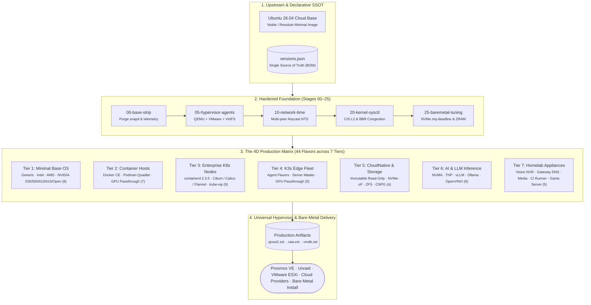

# lusoris-cloud-images

> Enterprise-grade, hardened, hardware-accelerated cloud and bare-metal OS images with pre-baked runtimes.

---

## What is lusoris-cloud-images?

`lusoris-cloud-images` is an automated OS image forge that builds production-ready, zero-bloat images for **virtualization** (Proxmox VE, Unraid, VMware ESXi, QEMU/KVM), **bare-metal servers**, and **public clouds**.

Instead of deploying generic stock distributions that spend minutes pulling gigabytes of packages and container layers on first boot, `lusoris-cloud-images` provides:

- **Zero Base Bloat**: Complete purge of `snapd`, `lxd`, Ubuntu Pro telemetry, and unneeded documentation.
- **Hardware Acceleration Tiers**: Tailored GPU driver stacks for Intel Arc/Xe, AMD Mesa & ROCm, and NVIDIA generational CUDA (Pascal 535, Ampere/Ada 565, Hopper/Blackwell Open Modules + Fabric Manager).
- **Multi-Hypervisor Portability**: Coexisting `qemu-guest-agent` and `open-vm-tools` plus Unraid `virtiofs` and `9p` host sharing out of the box.
- **Bare-Metal Performance Engine**: NVMe low-latency I/O scheduling, BBR congestion control, auto-growroot on first boot, and streaming direct flash (`lusoris-install-to-disk`).
- **Resilient Global Time**: Cryptographically authenticated Network Time Security (NTS) using Cloudflare Anycast and European national metrology institutes (PTB, Netnod, SIDN, 3eck).
- **Single Source of Truth (`versions.json`)**: Every upstream package, container image tag, and driver branch is centrally defined and automated via Renovate.

---

## Architecture Overview

---

## Quick Navigation

- [Explore the 4D Flavor Matrix](flavors/matrix.md)
- [Proxmox VE Deployment Guide](platforms/proxmox.md)
- [Unraid VM & VirtFS Guide](platforms/unraid.md)
- [VMware ESXi Import Guide](platforms/vmware.md)
- [Bare-Metal NVMe Flashing Guide](platforms/baremetal.md)
- [Architecture Decision Records (ADRs)](adr/README.md)

