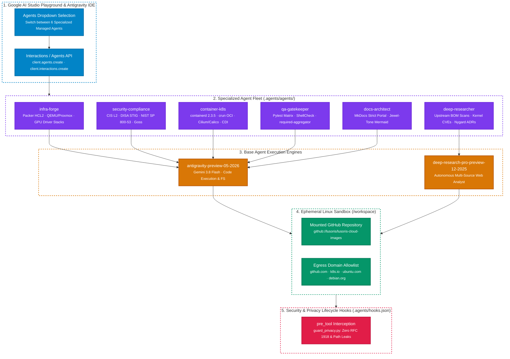

# Google AI Studio Managed Agents & Multi-Agent Orchestration

`lusoris-cloud-images` defines a fleet of specialized **Managed Agents** powered by the **Google Antigravity Agent** (`antigravity-preview-05-2026`) and **Gemini Deep Research Agent** (`deep-research-pro-preview-12-2025`), following the official Google Gemini Managed Agents architecture.

---

## 1. Multi-Agent Fleet Architecture



---

## 2. Agent Roster & Specializations

| Agent ID | Base Agent Engine | Core Specialization | Tools Enabled |
| :--- | :--- | :--- | :--- |
| **`lusoris-infra-forge`** | `antigravity-preview-05-2026` | Packer HCL2, standalone QEMU, Proxmox VE, GPU passthrough (Intel Xe2, AMD ROCm 10, NVIDIA 535–615), VirtIO storage tuning | `code_execution`, `filesystem_tools`, `google_search`, `url_context` |
| **`lusoris-security-compliance`** | `antigravity-preview-05-2026` | CIS L2 Server baseline, DISA STIG, OpenSSH CA integration (`00-hardened-sshd.conf`), NIST SP 800-53/190 crosswalks, Goss specs | `code_execution`, `filesystem_tools`, `google_search` |
| **`lusoris-container-k8s`** | `antigravity-preview-05-2026` | containerd 2.3.5, `crun` RuntimeClass, Cilium eBPF, Calico BGP, Flannel, kube-vip HA, and CDI device plugin integration | `code_execution`, `filesystem_tools`, `google_search`, `url_context` |
| **`lusoris-qa-gatekeeper`** | `antigravity-preview-05-2026` | Pytest verification suite (55+ tests), ShellCheck static analysis, Shfmt, Yamllint, and PR `required-aggregator` validation | `code_execution`, `filesystem_tools` |
| **`lusoris-deep-researcher`** | `deep-research-pro-preview-12-2025` | Multi-source architectural research, upstream distribution lifecycle tracking, kernel CVE impact assessment, Nygard ADR drafts | `google_search`, `url_context` |
| **`lusoris-docs-architect`** | `antigravity-preview-05-2026` | Strict MkDocs builds (`mkdocs build --strict`), high-contrast jewel-tone Mermaid architecture diagrams, and docs-to-code synchrony | `filesystem_tools`, `url_context` |

---

## 3. Populating Google AI Studio Dropdown

To register or update the fleet in your **Google AI Studio Playground**:

```bash
# Validate declarative agent specifications
python scripts/manage_aistudio_agents.py validate

# Register the fleet with your Gemini API Key
export GEMINI_API_KEY="your-api-key-here"
python scripts/manage_aistudio_agents.py register
```

Once registered:
1. Open [Google AI Studio](https://aistudio.google.com).
2. Navigate to the **Playground** tab and switch the toggle to **Agents**.
3. Open the **Agents dropdown**: all 6 specialized `lusoris-*` agents appear ready for execution with pre-mounted sources and tool configurations.

---

## 4. Multi-Agent Worktree Fan-Out Protocol

To prevent Git index conflicts and uncoordinated file overwrites during multi-agent workflows, background coding agents operate in isolated Git worktrees under `.workingdir2/worktrees/` per **Hard Rule 11**:

```bash
# Spawn an isolated worktree for infra-forge
python scripts/orchestrate_fanout.py spawn infra-forge feat/new-gpu-flavor

# Spawn an isolated worktree for security auditing
python scripts/orchestrate_fanout.py spawn security-compliance feat/audit-goss

# List active agent worktrees
python scripts/orchestrate_fanout.py list

# Prune worktree after PR merge
python scripts/orchestrate_fanout.py prune infra-forge
```

---

## 5. Automated Sandbox Lifecycle Hooks (`.agents/hooks.json`)

All managed agents executing within Google-hosted Linux sandboxes are subject to declarative interception hooks:

- **Privacy Guardrail (`pre_tool`)**: Before any write operation (`filesystem_tools.write_file`), `/.agents/hooks-scripts/guard_privacy.py` validates that no private RFC 1918 IPs (`10.x`, `192.168.x`, `172.16-31.x`) or local workstation home paths exist in the payload. Violations abort tool execution with exit code 1.
- **Power of 10 Linter (`post_tool`)**: Validates shell scripts to ensure functions remain $\le 60$ lines and strictly adhere to `set -euo pipefail`.
