# Bare-Metal & iPXE Deployment Guide

`lusoris-cloud-images` provides bare-metal optimized images with physical hardware tuning, microcode errata mitigations, and storage expansion.

## 1. Direct Block Flashing (`lusoris-install-to-disk`)

You can flash a compressed `.raw.zst` directly to physical NVMe or SATA storage from any live rescue environment (e.g. Ubuntu live CD, SystemRescue, Hetzner Rescue):

```bash
# Direct flash over network stream without saving uncompressed image to RAM
curl -fsSL https://releases.lusoris.org/lusoris-base-generic.raw.zst | \
  zstdcat | sudo dd of=/dev/nvme0n1 bs=4M status=progress conv=fsync
```

Or using the built-in helper utility:
```bash
lusoris-install-to-disk https://releases.lusoris.org/lusoris-base-generic.raw.zst /dev/nvme0n1
```



```mermaid
flowchart LR
    %% Semantic class definitions with vibrant, high-contrast jewel palettes
    classDef rescue fill:#d97706,stroke:#b45309,stroke-width:2px,color:#ffffff
    classDef remote fill:#0284c7,stroke:#0369a1,stroke-width:2px,color:#ffffff
    classDef disk fill:#7c3aed,stroke:#6d28d9,stroke-width:2px,color:#ffffff
    classDef boot fill:#059669,stroke:#047857,stroke-width:2px,color:#ffffff

    subgraph RescueEnv["Live Rescue Environment (RAM / Netboot)"]
        Curl["curl -fsSL (HTTP Stream)"]:::rescue
        Zstd["zstdcat (Decompress Stream)"]:::rescue
        DD["dd of=/dev/nvme0n1 bs=4M conv=fsync"]:::rescue
        Curl -->|Unix Pipe| Zstd -->|Raw Blocks| DD
    end

    subgraph RemoteStorage["Release Server / Object Storage"]
        RemoteImg[("lusoris-*.raw.zst<br/><small>Compressed Image Stream</small>")]:::remote
    end

    subgraph TargetDrive["Target Physical NVMe / SATA Disk"]
        GPT["GPT Partition Table<br/><small>Root Partition (20GB)</small>"]:::disk
    end

    subgraph FirstBoot["First Boot Sequence"]
        Growpart["growpart & resize2fs<br/><small>Expands to fill 100% of Drive</small>"]:::boot
        FullRoot[("Expanded Root Filesystem<br/><small>Full Capacity Online</small>")]:::boot
        Growpart --> FullRoot
    end

    RemoteImg -->|Network Stream| Curl
    DD -->|Direct Write| GPT
    GPT -.-> FirstBoot

    style RescueEnv fill:none,stroke:#d97706,stroke-width:2px,stroke-dasharray: 4 4
    style RemoteStorage fill:none,stroke:#0284c7,stroke-width:2px,stroke-dasharray: 4 4
    style TargetDrive fill:none,stroke:#7c3aed,stroke-width:2px,stroke-dasharray: 4 4
    style FirstBoot fill:none,stroke:#059669,stroke-width:2px,stroke-dasharray: 4 4
```

---

## 2. Automatic Root Disk Expansion

When flashing a 20GB `.raw.zst` image onto a 1TB, 2TB, or larger physical drive, `cloud-guest-utils` and `growpart` automatically resize the root GPT partition and filesystem to fill 100% of the drive on first boot.

## 3. CPU Microarchitecture & Hardware Profiles

- **Intel Bare-Metal**: Configured with `intel-microcode`, `intel_iommu=on iommu=pt`, and `intel_pstate=active`.
- **AMD Bare-Metal**: Configured with `amd64-microcode`, `amd_iommu=on iommu=pt`, and `amd_pstate=active`.
- **Physical NIC Drivers**: Pre-loads network firmware (`linux-firmware`) for Intel (`ice`, `i40e`, `ixgbe`), Broadcom (`bnxt_en`), and Mellanox ConnectX (`mlx5_core`).
- **NVMe Storage Scheduling**: Udev rules enforce `none` scheduler for NVMe drives to bypass CPU scheduler latency.

## 4. iPXE Netboot Chainloading

Example iPXE configuration snippet for network booting:
```ipxe
#!ipxe
kernel https://releases.lusoris.org/netboot/vmlinuz ip=dhcp root=/dev/ram0 ds=nocloud;s=http://ipxe.example.com/cloud-init/
initrd https://releases.lusoris.org/netboot/initrd.img
boot
```

