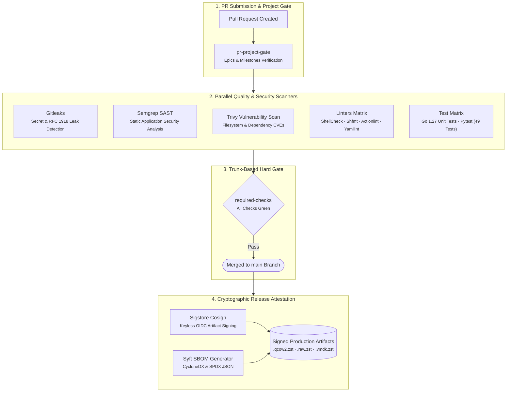

# Supply Chain Security & Attestation

Every official `lusoris-cloud-images` release follows modern supply-chain security best practices:

## 1. Cryptographic Signing via Cosign

Release artifacts are signed using **Sigstore Cosign** keyless signing. The signature is bound to the official GitHub Actions workflow run and repository identity:

```bash
cosign verify-blob \
  --certificate-identity "https://github.com/lusoris/lusoris-cloud-images/.github/workflows/release-matrix.yml@refs/tags/v0.1.0" \
  --certificate-oidc-issuer "https://token.actions.githubusercontent.com" \
  --signature SHA256SUMS.sig \
  SHA256SUMS
```

## 2. Software Bill of Materials (SBOM)

Every release provides a complete catalog of installed deb packages, container layers, and kernel modules generated by **Syft** in both:
- **CycloneDX JSON** (`sbom.cyclonedx.json`)
- **SPDX JSON** (`sbom.spdx.json`)

## 3. Automated Vulnerability Scanning

Images and repository code are continuously scanned via **Trivy** and **Semgrep** in CI, halting releases if unpatched `CRITICAL` CVEs are detected.

---

## 4. Continuous Assurance & PR Project Hard Gates

Every pull request is subjected to deterministic automated validation before reaching `main`:



