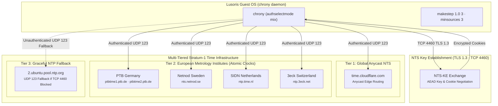

# Global Anycast NTS Time Architecture

Network Time Security (NTS) provides cryptographic authentication for the Network Time Protocol (NTP) using TLS 1.3 (RFC 8915). It prevents man-in-the-middle time manipulation attacks.

## Multi-Tiered Topology

`lusoris-cloud-images` implements a fault-tolerant multi-tier NTS topology configured in `/etc/chrony/sources.d/global-nts.sources`:

1. **Tier 1: Global Anycast NTS**
   - `server time.cloudflare.com iburst nts`
   - Provides worldwide single-digit millisecond latency via Anycast routing.
2. **Tier 2: European Stratum-1 National Metrology Institutes**
   - `ptbtime1.ptb.de` & `ptbtime2.ptb.de` (Physikalisch-Technische Bundesanstalt, Germany)
   - `nts.netnod.se` (Netnod, Sweden)
   - `ntp.time.nl` (SIDN Labs, Netherlands)
   - `ntp.3eck.net` (Switzerland)
3. **Tier 3: Graceful Fallback Pool**
   - `pool 2.ubuntu.pool.ntp.org iburst maxsources 4`
   - Ensures time synchronization continues without failure if an enterprise network firewall blocks TCP port 4460 (NTS-KE).

---

## Chrony Policy (`/etc/chrony/conf.d/global-policy.conf`)
- `authselectmode mix`: Prefers cryptographically authenticated NTS sources, gracefully falling back to standard NTP if NTS is unreachable.
- `makestep 1.0 3`: Steps the system clock if offset is greater than 1 second in the first 3 clock updates.
- `minsources 3`: Mandates at least 3 active sources for consensus before steering time.

