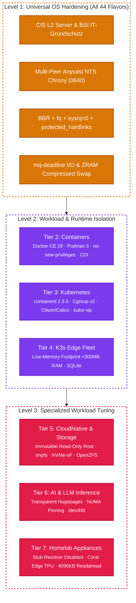

# Flavor-by-Flavor Hardening and Verification Standards

`lusoris-cloud-images` defines explicit, verifiable hardening contracts for every workload tier and hardware stack across all 44 flavors. These contracts are machine-verifiable via `lusoris-forge standards [flavor]`, `lusoris-forge lint`, and the automated health audit suite.

---

## 1. Matrix Overview Across the 7 Workload Tiers

---

## 2. Tier 1: Minimal Base Cloud OS (8 Flavors)

### Flavors:
- `base-generic`, `base-intel`, `base-amd`, `base-nvidia-legacy`, `base-nvidia-mainstream`, `base-nvidia-modern`, `base-nvidia-bleeding`, `base-nvidia-datacenter`

### Hardening Invariants:
1. **Zero Base Bloat**: Complete uninstallation of `snapd`, `lxd`, `ubuntu-advantage-tools`, `motd-news`, and apt doc/man page caches.
2. **Resilient Network Time Security (NTS)**:
   - Primary: Anycast NTS (`time.cloudflare.com:4460` or configured endpoint).
   - Stratum-1 Peer Mesh: European national metrology labs (PTB, Netnod, SIDN, 3eck).
   - Fallback: Pool NTP with maxpoll 10.
   - Chrony configuration permissions: `0640`, owner `root:root`.
3. **Hypervisor Agent Coexistence**:
   - `qemu-guest-agent.service` enabled.
   - `open-vm-tools.service` enabled with `ConditionVirtualization=vmware` drop-in.
   - `acpid.service` enabled for graceful host shutdown signals.
   - `spice-vdagent.service` enabled for desktop console clipboard integration.
4. **Kernel Parameters (`/etc/sysctl.d/99-lusoris-kernel.conf`)**:
   - `net.ipv4.tcp_congestion_control = bbr`
   - `net.core.default_qdisc = fq`
   - `vm.swappiness = 10`
   - `kernel.sysrq = 0`
   - `fs.protected_hardlinks = 1`
   - `fs.protected_symlinks = 1`

---

## 3. Tier 2: Container Hosts (7 Flavors)

### Flavors:
- `docker-generic`, `docker-intel`, `docker-amd`, `docker-nvidia`, `docker-nvidia-modern`, `docker-nvidia-bleeding`, `podman-generic`

### Hardening Invariants:
1. **Container Engine Configuration (`/etc/docker/daemon.json`)**:
   - Native cgroupdriver set to `systemd` (`exec-opts: ["native.cgroupdriver=systemd"]`).
   - Standard logging driver: `json-file` with strict log rotation (`max-size: "50m"`, `max-file: "3"`).
   - Live restore enabled (`live-restore: true`) to preserve running containers during daemon updates.
   - Userland proxy disabled (`userland-proxy: false`) to avoid hairpin NAT overhead.
2. **Container Device Interface (CDI)**:
   - Declarative device injection files generated under `/etc/cdi/*.yaml` or `/etc/cdi/*.json`.
   - File permissions: `0644`, owner `root:root`.
   - Validation: Schema conforms to Container Device Interface v0.6.0+.
3. **Podman Invariants (`podman-generic`)**:
   - CNI/Netavark networking with firewall-reload hooks.
   - Quadlet systemd service generation support (`/etc/containers/systemd/`).

---

## 4. Tier 3: Enterprise Kubernetes Nodes (9 Flavors)

### Flavors:
- `k8s-node-generic`, `k8s-node-cilium`, `k8s-node-calico`, `k8s-node-flannel`, `k8s-node-intel`, `k8s-node-amd`, `k8s-node-nvidia`, `k8s-node-nvidia-modern`, `k8s-node-nvidia-bleeding`

### Hardening Invariants:
1. **Container Runtime (`containerd 2.3.x`)**:
   - CRI plugin configured with `SystemdCgroup = true`.
   - Discard unpacked layers enabled for storage economy.
2. **Kubelet & Host Bridging (`/etc/sysctl.d/99-kubernetes-cri.conf`)**:
   - `net.bridge.bridge-nf-call-iptables = 1`
   - `net.bridge.bridge-nf-call-ip6tables = 1`
   - `net.ipv4.ip_forward = 1`
   - Kernel module autoloading: `br_netfilter`, `overlay`.
3. **Image Preheating**:
   - CNI images (`cilium`, `calico`, `flannel`) and cluster essentials (`kube-vip`, `pause`, `coredns`) pre-pulled into containerd CRI image namespace.
   - Preheating eliminates image pull storms on cluster scale-out events.

---

## 5. Tier 4: K3s Edge Fleet (5 Flavors)

### Flavors:
- `k3s-agent-generic`, `k3s-agent-intel`, `k3s-agent-amd`, `k3s-agent-nvidia`, `k3s-server-generic`

### Hardening Invariants:
1. **Memory Budget**:
   - Idle resident set size (RSS) < 300MB RAM.
   - Embedded containerd runtime with disabled legacy storage drivers.
2. **Configuration Layout (`/etc/rancher/k3s/config.yaml`)**:
   - Agent: `token-file` or environment variable injection.
   - Server: Embedded SQLite or external datastore endpoints.
   - Flannel backend: `host-gw` or `wireguard-native` with minimal MTU overhead.
3. **Hardware Adaptation**:
   - Intel N100 / Alder Lake-N: QuickSync hardware acceleration (`/dev/dri/renderD128`) pre-configured with `render` group permissions.

---

## 6. Tier 5: Cloud-Native Immutable & Storage Appliances (4 Flavors)

### Flavors:
- `cloudnative-generic`, `cloudnative-k8s`, `cloudnative-storage`, `cloudnative-pg`

### Hardening Invariants:
1. **Immutable Filesystem Protection (`cloudnative-generic`, `cloudnative-k8s`)**:
   - Read-only root mount option (`ro`) in fstab or kernel command line.
   - Ephemeral `/var/log` and `/tmp` mounted via tmpfs with strict size limits.
   - System updates delivered via image replacement rather than in-place apt mutations.
2. **CNCF Storage Invariants (`cloudnative-storage`)**:
   - OpenZFS 2.3 kernel modules pre-loaded (`zfs.ko`).
   - NVMe over Fabrics (TCP) kernel modules autoloaded (`nvme-core`, `nvme-fabrics`, `nvme-tcp`).
   - Multipath daemon (`multipathd.service`) configured with `find_multipaths yes`.
3. **PostgreSQL / CloudNativePG Host Tuning (`cloudnative-pg`)**:
   - `vm.overcommit_memory = 2`
   - `vm.overcommit_ratio = 80`
   - `vm.dirty_background_ratio = 5`
   - `vm.dirty_ratio = 10`
   - Transparent Hugepages enabled with `[madvise]`.
   - File limits: `nofile 1048576`, `nproc 524288`.

---

## 7. Tier 6: AI & LLM Inference Appliances (6 Flavors)

### Flavors:
- `ai-infer-generic`, `ai-infer-intel`, `ai-infer-amd`, `ai-infer-nvidia`, `ai-infer-nvidia-modern`, `ai-infer-nvidia-bleeding`

### Hardening Invariants:
1. **Memory & NUMA Tuning**:
   - Transparent Hugepages set to `always` or `madvise` in sysfs.
   - `vm.zone_reclaim_mode = 0` to avoid costly NUMA node stalls.
   - Process memlock limit: `unlimited` in `/etc/security/limits.d/99-ai-infer.conf`.
2. **GPU & Accelerator Runtimes**:
   - NVIDIA: Persistence mode enabled (`nvidia-smi -pm 1`), CDI generated, Open Kernel Modules for Blackwell/Hopper.
   - AMD ROCm: `/dev/kfd` and `/dev/dri` access rights for `video` and `render` groups.
   - Intel: Level Zero loader (`libze_loader`), OpenVINO runtime libraries, and Compute Runtime ICD files.

---

## 8. Tier 7: Specialized Homelab Appliances (5 Flavors)

### Flavors:
- `appliance-vision-nvr`, `appliance-gateway-dns`, `appliance-media-server`, `appliance-ci-runner`, `appliance-game-server`

### Hardening Invariants:
1. **`appliance-vision-nvr`**:
   - Google Coral Edge TPU: `gasket-dkms` module installed, udev rule `SUBSYSTEM=="apex", MODE="0660", GROUP="render"`.
   - Intel Media Driver (`iHD`) with VA-API hardware passthrough for low-latency RTSP decoding.
2. **`appliance-gateway-dns`**:
   - Systemd-resolved port 53 stub disabled (`DNSStubListener=no`) to avoid collision with AdGuard Home / Pi-hole.
   - WireGuard kernel module autoloaded, IPv4/IPv6 packet forwarding enabled.
3. **`appliance-media-server`**:
   - Dual-vendor VA-API drivers (`intel-media-va-driver-non-free`, `mesa-va-drivers`).
   - Storage client utilities pre-installed (`nfs-common`, `cifs-utils`).
   - Disk readahead tuned to 4096KB via udev rule for uninterrupted 4K Remux streaming.
4. **`appliance-ci-runner`**:
   - Multi-arch Docker build support via QEMU binfmt emulation (`qemu-user-static`).
   - Pre-allocated 4GB tmpfs mounted at `/tmp` for ultra-fast ephemeral compilation.
5. **`appliance-game-server`**:
   - 32-bit `i386` multi-architecture enabled with 32-bit glibc packages.
   - Network UDP buffer tuning: `net.core.rmem_max = 16777216`, `net.core.wmem_max = 16777216`.
   - SteamCMD execution wrapper pre-installed.

---

## 9. NIST SP 800-53 (Rev. 5) & NIST SP 800-190 Compliance Crosswalk

Following [ADR-0011](../adr/0011-enterprise-golden-image-compliance-and-lifecycle.md), all `lusoris-cloud-images` flavors implement a formal crosswalk to federal cybersecurity standards:

| Regulatory Standard | Control ID | Concrete Implementation in `lusoris-cloud-images` | Automated Verification |
| :--- | :--- | :--- | :--- |
| **NIST SP 800-53** | **AC-6 (Least Privilege)** | Non-essential setuid/setgid bits stripped; execution permissions restricted on low-level toolchains (`chmod 0700 /usr/bin/as /usr/bin/byacc`); unprivileged runtime UIDs (UID >= 10001). | `test_provisioners_no_banned_constructs` |
| **NIST SP 800-53** | **CM-6 (Configuration Settings)** | 100% declarative SSOT in [`versions.json`](https://github.com/lusoris/lusoris-cloud-images/blob/main/versions.json); zero hardcoded distribution URLs or versions; sysctl hardening in `/etc/sysctl.d/99-lusoris.conf`. | `test_schema_conformance`, `goss.yaml` |
| **NIST SP 800-53** | **SI-2 (Flaw Remediation)** | Zero in-place patching policy. Base images are regenerated on weekly cadences with upstream security errata, producing immutable release artifacts. | CI matrix rebuilds, 30-day deprecation flags |
| **NIST SP 800-53** | **SI-4 (Information Monitoring)** | Audit subsystem configured with safe buffer scaling (`-b 8192 -f 1`); BPF JIT hardened (`bpf_jit_harden = 2`); eBPF execution restricted to administrative contexts. | `tests/compliance/goss.yaml` |
| **NIST SP 800-190** | **Application Container Security** | Default compilers (`gcc`, `make`, `clang`) purged from runtime layers; read-only rootfilesystems (`cloudnative-*`); seccomp default profiles; rootless Podman execution (`41-podman-runtime.sh`). | `test_all_flavors_in_catalog_and_matrix` |

---

## 10. OpenSSH Hardening Baseline & Certificate Authority (CA) Integration

All production images ship with a hardened OpenSSH configuration drop-in at `/etc/ssh/sshd_config.d/00-hardened-sshd.conf` (permissions `0600`):

### 10.1 Cryptographic Suites
- **Key Exchange**: `curve25519-sha256`, `curve25519-sha256@libssh.org`, `diffie-hellman-group16-sha512`, `diffie-hellman-group18-sha512`.
- **Ciphers**: `chacha20-poly1305@openssh.com`, `aes256-gcm@openssh.com`, `aes128-gcm@openssh.com`.
- **MACs**: `hmac-sha2-512-etm@openssh.com`, `hmac-sha2-256-etm@openssh.com`.

### 10.2 Operational Boundaries & Session Controls
- `PermitRootLogin no`: Direct root SSH access is completely blocked.
- `PasswordAuthentication no`: Enforced upon final snapshot sealing in `99-cleanup.sh`. Access strictly requires SSH keys or CA certificates.
- `MaxAuthTries 3` and `MaxSessions 2`: Mitigates brute-force authentication attempts.
- `ClientAliveInterval 300` and `ClientAliveCountMax 0`: Terminates unresponsive or orphaned sessions.
- `X11Forwarding no`, `AllowTcpForwarding no`, `AllowAgentForwarding no`: Prevents lateral proxy hopping and agent hijacking.

### 10.3 Enterprise OpenSSH Certificate Authority
Images pre-configure `TrustedUserCAKeys /etc/ssh/trusted-user-ca-keys.pub`. Organizations can deploy enterprise CA public keys via cloud-init or configuration management, enabling engineers to authenticate using short-lived (1–8h), MFA-backed user certificates issued by identity providers (IdPs) without managing static `authorized_keys`.
