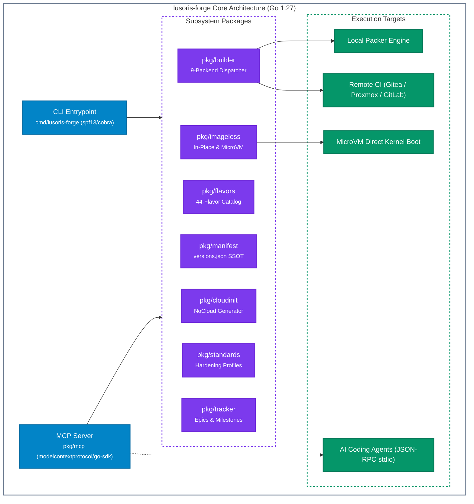
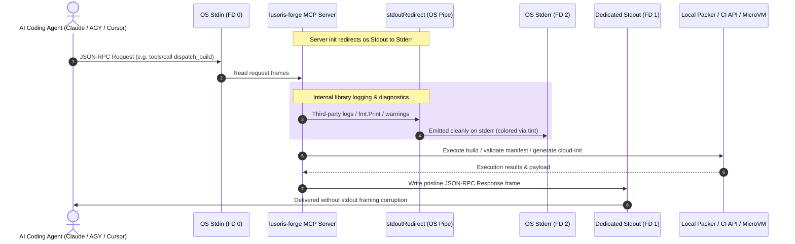

# Lusoris Forge: Unified CLI & AI Model Context Protocol (MCP) Server

`lusoris-forge` is the bleeding-edge Go 1.27 engineering CLI and official Model Context Protocol (MCP) server for `lusoris-cloud-images`. It unifies the 44-flavor catalog, cloud-init generator, multi-backend build dispatcher, imageless host provisioning, machine-verifiable hardening standards, and recurring Epics/Milestones lifecycle tracking.

---

## 1. Architectural Principles

1. **Stdout Purity & Framing Protection**: In `stdio` MCP transport mode, `lusoris-forge` pins genuine `os.Stdout` exclusively for JSON-RPC message framing. All internal runtime messages and third-party library writes are redirected through an OS-level pipe to `os.Stderr` via `lmittmann/tint`, preventing stream corruption.
2. **Single Source of Truth (`versions.json`)**: Version extraction and semantic assertions are performed directly against `versions.json` and `.github/epics.json`.
3. **Imageless Execution First**: Enables instant in-place host transformation or direct microVM kernel booting without requiring heavy disk imaging pipelines.
4. **Power of 10 & SEI CERT Compliance**: Every Go function is constrained to $\le 60$ statements with strict error wrapping (`%w`), zero goroutine leaks, and bounded timeouts.



---

## 2. Command-Line Interface (CLI) Reference

### 2.1 Flavor Catalog (`flavors`)
```bash
# List all 44 production flavors across all 7 tiers
lusoris-forge flavors list

# Filter flavors by workload tier
lusoris-forge flavors list --tier=kubernetes
lusoris-forge flavors list --tier=homelab

# Output machine-readable JSON
lusoris-forge flavors list --json

# Inspect exact specifications and provisioners for a flavor
lusoris-forge flavors get appliance-vision-nvr
```

### 2.2 Version Manifest Verification (`manifest`)
```bash
# Validate versions.json semantic invariants
lusoris-forge manifest validate
```

### 2.3 Hardened Cloud-Init Generation (`cloud-init`)
Generates production-hardened `user-data` YAML with Anycast NTS, secure non-root users, and hypervisor optimizations:
```bash
# Generate Proxmox cloud-init user-data
lusoris-forge cloud-init generate --flavor=base-generic --hostname=node-01

# Generate Unraid virtiofs user-data
lusoris-forge cloud-init generate --flavor=docker-generic --platform=unraid

# Generate Apple Silicon macOS UTM user-data
lusoris-forge cloud-init generate --flavor=base-generic --platform=macos
```

### 2.4 Multi-Backend Build Dispatcher (`build`)
Dispatches builds to local Packer or remote CI backends:
```bash
# Formulate local packer build command
lusoris-forge build --flavor=base-generic --backend=local

# Simulate dispatch to self-hosted Gitea / Forgejo Actions
lusoris-forge build --flavor=k8s-node-cilium --backend=gitea --dry-run

# Trigger Proxmox VE template clone
lusoris-forge build --flavor=cloudnative-storage --backend=proxmox
```

Supported Backends: `local`, `gitea`, `proxmox`, `gitlab`, `woodpecker`, `harbor`, `minio`, `jenkins`, `github`.

### 2.5 Imageless Host Provisioning (`apply`)
Transforms a running Linux machine or container directly into any of the 44 flavors without flashing virtual disks:
```bash
# Dry-run inspection of provisioner steps
lusoris-forge apply --flavor=ai-infer-nvidia --dry-run

# Execute in-place flavor application
lusoris-forge apply --flavor=docker-generic | sudo bash
```

### 2.6 MicroVM Direct Kernel Boot (`boot`)
Generates direct kernel/initramfs boot commands for QEMU, Cloud-Hypervisor, or Firecracker:
```bash
lusoris-forge boot --flavor=ai-infer-generic --kernel=/boot/vmlinuz --initrd=/boot/initrd.img
```

### 2.7 Machine-Verifiable Hardening Standards (`standards`)
```bash
# List hardening baselines across all 44 flavors
lusoris-forge standards list

# Output exact sysctl, package, and systemd requirements for a flavor
lusoris-forge standards get k8s-node-cilium
```

### 2.8 Epics and Milestones Tracking (`epics`, `milestones`)
```bash
# List tracked recurring operational epics
lusoris-forge epics list

# List open release milestones and due dates
lusoris-forge milestones list
```

### 2.9 Static Analysis & Repository Health (`lint`, `audit`)
```bash
# Run internal schema and catalog linters
lusoris-forge lint

# Execute repository health audit script
lusoris-forge audit
```

---

## 3. Model Context Protocol (MCP) Server Integration

`lusoris-forge` exposes native AI tooling conforming to the Model Context Protocol v1.7.0.

### 3.1 Launching the Server
```bash
# Stdio transport (default for AI agents, Claude Desktop, Cursor)
lusoris-forge mcp --transport=stdio
```

### 3.2 Client Configuration Example (`claude_desktop_config.json`)
```json
{
  "mcpServers": {
    "lusoris-forge": {
      "command": "/usr/local/bin/lusoris-forge",
      "args": ["mcp", "--transport=stdio"]
    }
  }
}
```

### 3.3 Registered MCP Tools

| Tool Identifier | Parameters | Description |
| :--- | :--- | :--- |
| **`list_flavors`** | `tier` (optional string) | List available flavors filtered by workload tier |
| **`get_flavor`** | `flavor_id` (string) | Return hardware stack, kernel profile, and provisioners |
| **`validate_manifest`**| `path` (optional string) | Validate `versions.json` Single Source of Truth |
| **`generate_cloudinit`**| `flavor`, `hostname`, `platform` | Generate hardened cloud-init YAML user-data |
| **`get_standards`** | `flavor_id` (string) | Query machine-readable CIS/BSI hardening requirements |
| **`list_epics`** | None | List recurring operational and architectural epics |
| **`get_milestones`** | None | List active release milestones |
| **`trigger_build`** | `flavor`, `backend`, `dry_run` | Dispatch build to local or remote CI backends |
| **`apply_flavor`** | `flavor_id`, `dry_run` | Generate in-place host provisioning bash script |

---

### 3.4 MCP Stdio Protocol & Framing Protection Sequence



